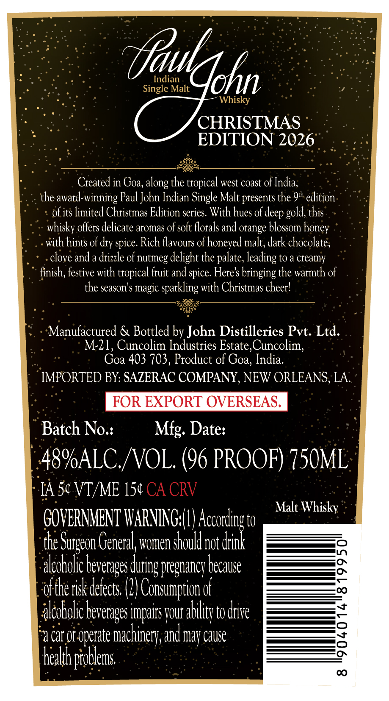
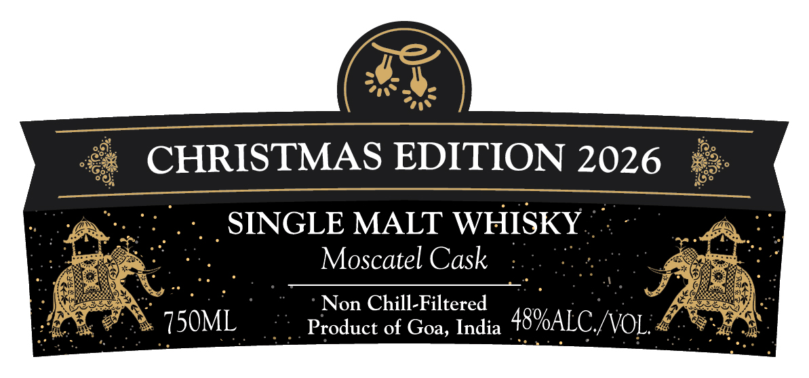

# TTB COLA Label Images - TTBID 26099001000313

**Brand Name:** PAUL JOHN

**Issue Date:** 04/10/2026

**Origin Code:** 5I

**Product Class/Type:** 118

**Source:** [TTB Public COLA Registry](https://ttbonline.gov/colasonline/viewColaDetails.do?action=publicFormDisplay&ttbid=26099001000313)

## Label Images

### Back Label

### Front Label

## Extracted Label Text

*Text extracted via OCR - may contain errors*

**Detected Proof:** 96

### Back Label

Indian
Single Malt
Whisky
CHRISTMAS
EDITION 2026
Created in Goa,
the tropical west coast of India;
the award-winning Paul John Indian Single Malt presents the 9h edition
of its limited Christmas Edition series: With hues of
this
whisky offers delicate aromas of soft florals and orange blossom
with hints of dry spice. Rich flavours of honeyed malt; dark chocolate;
clove and a drizzle of nutmeg delight the palate; leading to a creamy
finish; festive with tropical fruit and spice: Heres bringing the warmth of
the season'$
magic sparkling with Christmas cheer!
Manufactured & Bottled by John Distilleries Pvt: Ltd.
M-21, Cuncolim Industries Estate, Cuncolim,
Goa 403 703, Product of Goa, India:
IMPORTED BY: SAZERAC COMPANY, NEW ORLEANS, LA:
FOR EXPORT OVERSEAS.
Batch No.:
Mfg: Date:
48%ALC /VOL (96 PROOF) 750ML
IA 5c VT/ME 154 CA CRV
Malt Whisky
GOVERNMENT TARNING (L)
to
the
General women shoukd _
knhei
not
akcoholic |
'pregnancy because
2
ofthe risk detects: (2| Consumption of
0
alcoholic |
ipairs Jour ability to drive
a car Of operate
'machinery; and may cause
1
heath probtems
C
{fautdohn
along '
deep E
gold,
honey
Surgeon !
s during c
beverapes (
beverages '

### Front Label

CHRISTMAS EDITION 2026
SINGLE MALT WHISKY
Moscatel Cask
Non Chill-Filtered
750ML
Product of Goa, India
48VALC /NOL
