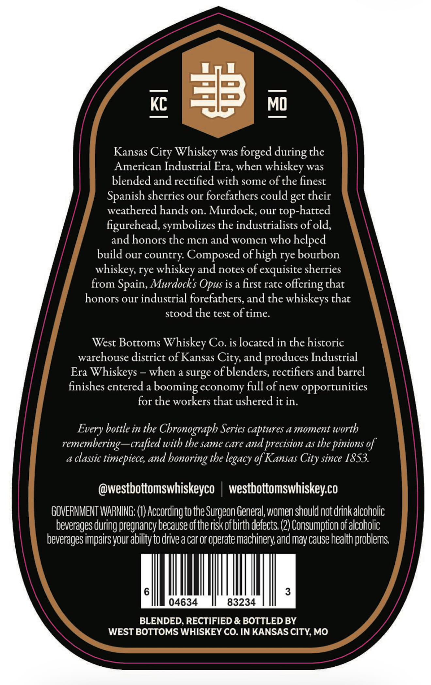
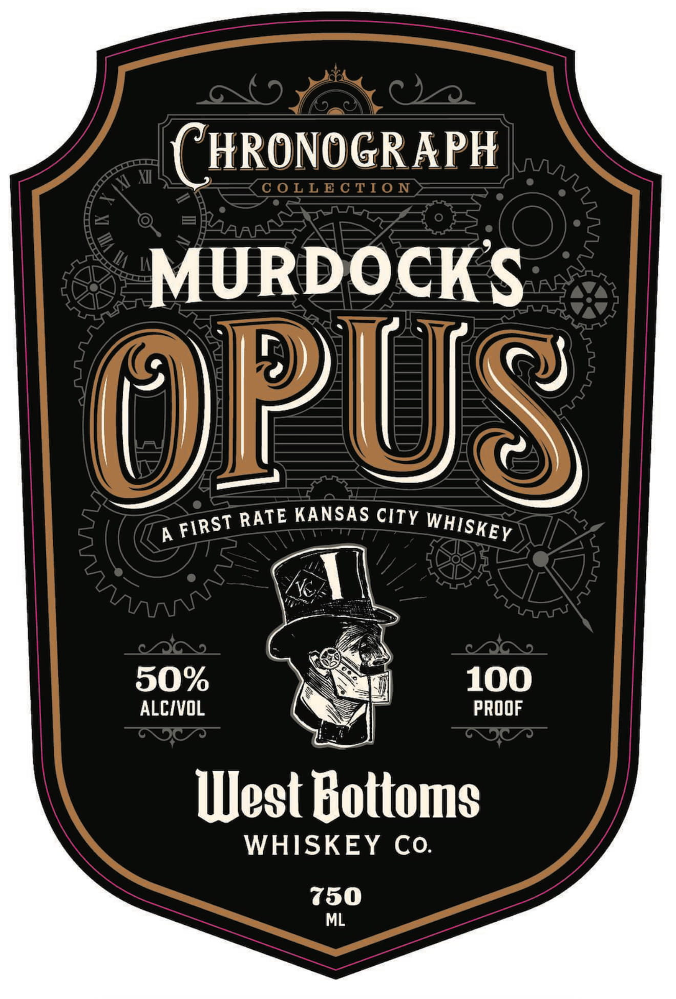
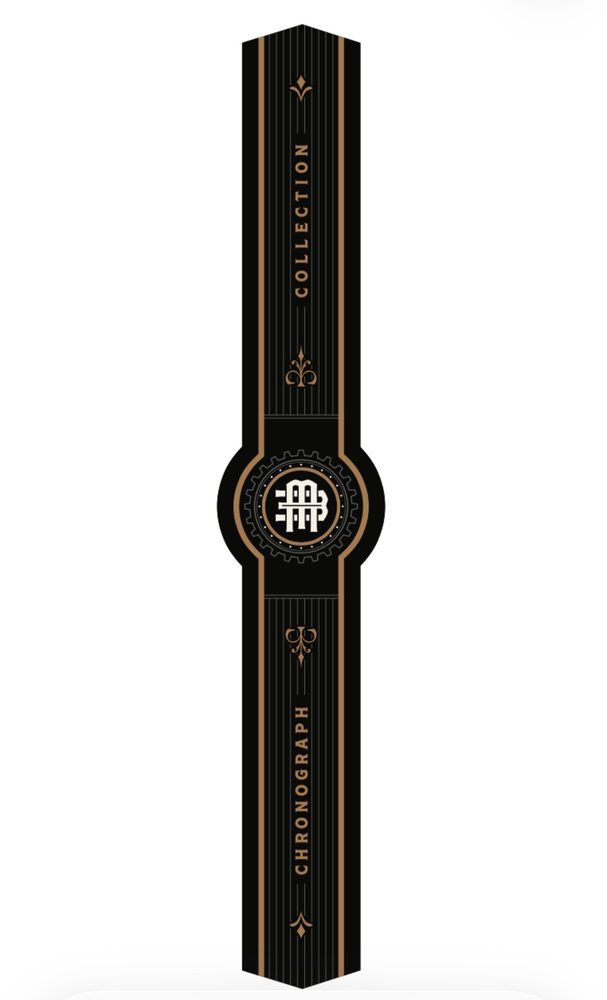

# TTB COLA Label Images - TTBID 26099001000348

**Brand Name:** WEST BOTTOMS WHISKEY CO

**Fanciful Name:** MURDOCKS OPUS

**Issue Date:** 06/01/2026

**Origin Code:** 29

**Product Class/Type:** 140

**Source:** [TTB Public COLA Registry](https://ttbonline.gov/colasonline/viewColaDetails.do?action=publicFormDisplay&ttbid=26099001000348)

## Label Images

### Back Label

### Front Label

### Label 2

## Extracted Label Text

*Text extracted via OCR - may contain errors*

*1 image(s) excluded: text did not meet readability threshold*

**Detected Proof:** 100

### Back Label

KC
#
MD
Kansas
Whiskey
was
forged
the
American Industrial Era, when whiskey was
blended and rectified with some of the finest
Spanish sherries our forefathers could get their
weathered hands on. Murdock; our
top-hatted
figurehead, symbolizes the industrialists of old;
and honors the men and women who helped
build our country Composed ofhigh rye bourbon
whiskey, rye whiskey and notes of exquisite sherries
from Spain, Murdocks
is a first rate
offering that
honors our industrial forefathers, and the whiskeys that
stood the test oftime
West Bottoms Whiskey Co. is located in the historic
warehouse district of Kansas
and produces Industrial
Era Whiskeys
when a surge of blenders, rectifiers and barrel
finishes entered a boom
ling economy full of new opportunities
for the workers that ushered it in.
bottle in the Chronograph Series captures a moment worth
remembering
~crafted with the same care and precision as the pinions of
a classic timepiece, and honoring the
of Kansas
since 1853.
@westbottomswhiskeyco
westbottomswhiskeyco
GOVERNMENT WARNING: (€) According to the Surgeon General women should notdrinkalcohotic
beverages
Ipregnancy because ofthe risk ofbirth defects; (2) Consumption ofalcoholic
beveragesimpairsyour ability to drive a car or operate machinery and maycause health problems
6
3
04634
83234
BLENDED, RECTIFIED & BOTTLED BY
WEST BOTTOMS WHISKEY CO. IN KANSAS CITY MO
during
City
Opus `
City;
Every
legacy
City
during 5

### Front Label

HRONOGRAPH
 X
C 0LL E C TI0 N
MURDOCKS
IT
RATE KANSAS CITY
A
50%
100
ALCIVOL
PROOF
West Bottoms
WHISKEY Co.
750
ML
D
WHISKEY
FIRST
