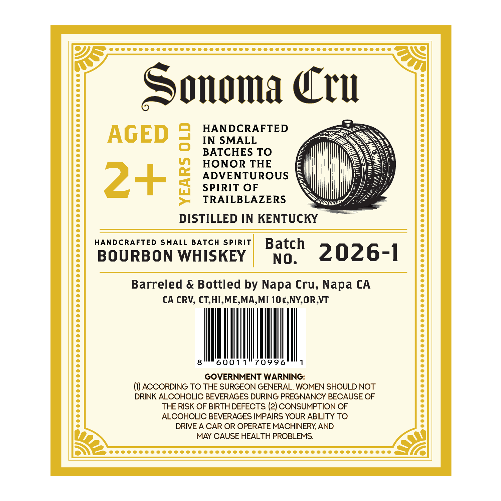
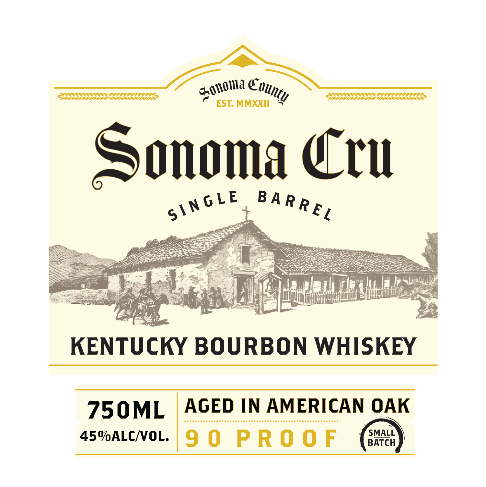

# TTB COLA Label Images - TTBID 26099001000375

**Brand Name:** SONOMA CRU SINGLE BARREL KENTUCKY BOURBON WHISKEY

**Issue Date:** 04/10/2026

**Origin Code:** 01

**Product Class/Type:** 141

**Source:** [TTB Public COLA Registry](https://ttbonline.gov/colasonline/viewColaDetails.do?action=publicFormDisplay&ttbid=26099001000375)

## Label Images

### Back Label

### Label 1

## Extracted Label Text

*Text extracted via OCR - may contain errors*

**Detected Proof:** 99

### Back Label

Sonoma Ccu
HANDCRAFTED
AGED 3
IN SMALL
BATCHES TO
HONOR THE
2+3
SPIREN OROUS
TRAILBLAZERS
DISTILLED IN KENTUCKY
HANDCRAFTED
SMALL BATCH
Spirit
Batch
BOURBON WHISKEY
NO.
2026-1
Barreled & Bottled by Napa Cru, Napa CA
CA CRV, CT,HI,ME,MA,MI  OC,NYOR,VT
6001
70996
GOVERNMENT WARNING:
ACCORDING TO THE SURGEON GENERAL, WOMEN SHOULD NOT
DRINK ALCOHOLIC BEVERAGES DURING PREGNANCY BECAUSE OF
THE RISK OF BIRTH DEFECTS (2) CONSUMPTION OF
ALCOHOLIC BEVERAGES IMPAIRS YOUR ABILITY TO
DRIVE A CAR OR OPERATE MACHINERY AND
MAY CAUSE HEALTH PROBLEMS

### Label 1

OER

SSSSSSS SSN

.

\\\

\)

m1

ag,

Olin, ,

—~

BSSSSS SN IIe

QASSSAAASAAALS

oY

EST. MMXXII

Sonoma Cru

\netF BARRE

ox

Er

Z

3.

Hee

y

= b\

Fy

oy A

inf

Li

iid FL

4

oy

Cie

KENTU

cKY BOURBON WHISKEY

750ML | AGED IN AMERICAN OAK

dene eeeeeneeeeeeeeaeseaeeneeseseaeaeneeseseseasseneeeees

f/sMaLL

45MALCVOL. 99 PROOF

BATCH
