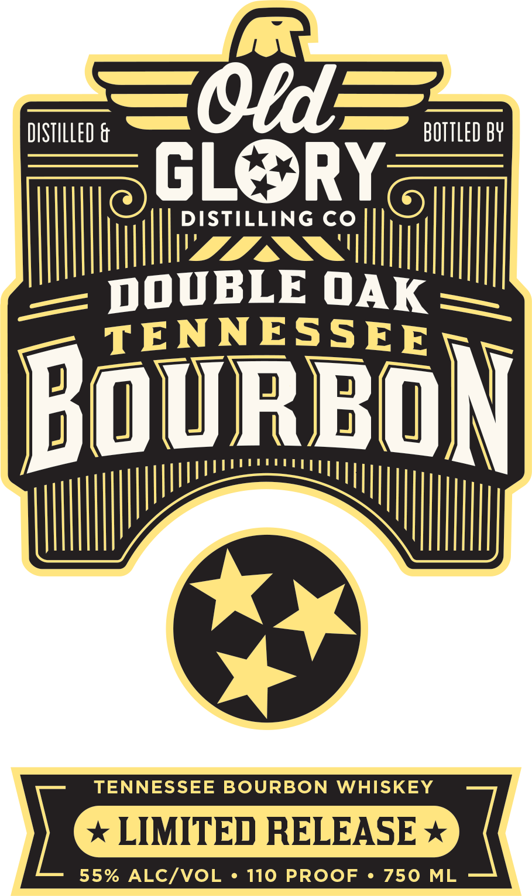

# TTB COLA Label Images - TTBID 26099001000785

**Brand Name:** DOUBLE OAK TENNESSEE BOURBON

**Issue Date:** 04/10/2026

**Origin Code:** 43

**Product Class/Type:** 141

**Source:** [TTB Public COLA Registry](https://ttbonline.gov/colasonline/viewColaDetails.do?action=publicFormDisplay&ttbid=26099001000785)

## Label Images

### Back Label

### Front Label

## Extracted Label Text

*Text extracted via OCR - may contain errors*

*1 image(s) excluded: text did not meet readability threshold*

**Detected Proof:** 110

### Front Label

DISTILLED &
O8de
BOTTLED BY
GLe
RY
DISTILLING CO
DOUBLE OAK
TENNESSEE
B@vRBoN
TENNESSEE BOURBON WHISKEY
LIMITED RELEASE
55% ALC/VOL
110 PROoF
750
ML
