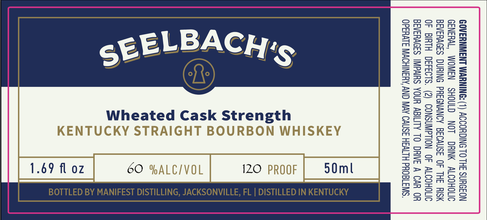

# TTB COLA Label Images - TTBID 26099001000855

**Brand Name:** SEELBACH'S

**Fanciful Name:** WHEATED CASK STRENGTH

**Issue Date:** 04/10/2026

**Origin Code:** 16

**Product Class/Type:** 101

**Source:** [TTB Public COLA Registry](https://ttbonline.gov/colasonline/viewColaDetails.do?action=publicFormDisplay&ttbid=26099001000855)

## Label Images

### Label 1

## Extracted Label Text

*Text extracted via OCR - may contain errors*

### Label 1

GOVERNMENT WARNING: (1) ACCORDING TO THE SURGEON
GENERAL, WOMEN SHOULD NOT DRINK ALCOHOLIC
BEVERAGES DURING PREGNANCY BECAUSE OF THE RISK
OF BIRTH DEFECTS. (2) CONSUMPTION OF ALCOHOLIC
BEVERAGES IMPAIRS YOUR ABILITY TO DRIVE A CAR OR
OPERATE MACHINERY, AND MAY CAUSE HEALTH PROBLEMS.

FLL

E,

ONVILL

G, JACK

ILLING

T
1

£ =
td
[oY
|<¢
(ts
&
Pe
WY =
7)
© =
W=
ao)
oY:
Sg.
©!
C7)
i
i
