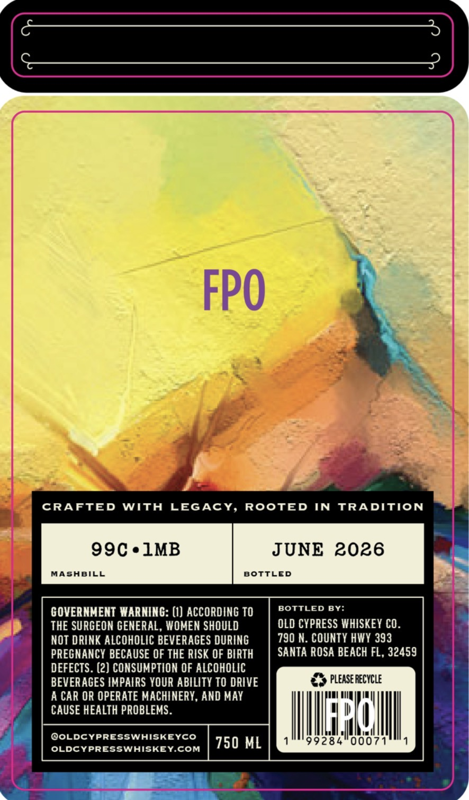
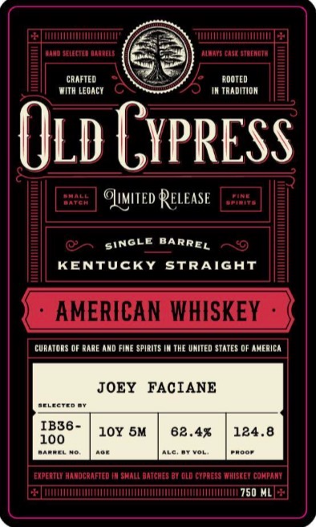

# TTB COLA Label Images - TTBID 26099001000899

**Brand Name:** OLD CYPRESS WHISKEY CO.

**Issue Date:** 05/04/2026

**Origin Code:** 16

**Product Class/Type:** 100

**Source:** [TTB Public COLA Registry](https://ttbonline.gov/colasonline/viewColaDetails.do?action=publicFormDisplay&ttbid=26099001000899)

## Label Images

### Back Label

### Front Label

## Extracted Label Text

*Text extracted via OCR - may contain errors*

### Back Label

FPO
CRAFTED
With
LEGAcY,
ROOTED
IN
TRADITION
99C.1MB
JUNE 2026
MASABILL
BOTTLED
GOVERNMENT WARNING: (I) ACCORDING TO
BOTTLED
BY:
THE SURGEON GENERAL, WOMEN SHOULD
OLD CYPRESS WHISKEY CO_
NOT DRINK ALCOHOLIC BEVERAGES DURING
790 N. COUNTY HWY 393
PREGNANCY BECAUSE OF THE RISK OF BIRTH
SANTA ROSA BEACH FL , 32459
DEFECTS . (2) CONSUMPTION OF ALCOHOLIC
BEVERAGES IMPAIRS YOUR ABILITY TO DRIVE
please RecYCLE
A CAR OR OPERATE MACHINERY, AND MAY
CAUSE HEALTH PROBLEMS.
PLh
@OLDCYPRESSWHISKEYCO
750 ML
99284"00071
OLDCYPRESSWHISKEYCOM

### Front Label

FfEtT
KtafanTH
CRAFTED
ADOTED
With LEoAcT
TrADITIDN
Old Gypress
AMAE
ReleaSe
KO
KENTUCKY
StRAiGhT
AMERICAN WHISKEY
cunatons OF panE Amd FIME spirIts
THE uhItEd STATES @F america
JOEY
FACIANE
JELGCTED
IB36 -
10Y 5M
62.4
124.8
100
Aaerere
Ehdo
ERPEATLN anocanfted In suae
ATCHES O8 0ld cXpnesa WSREY cokpani
750
OLuMiTEd s
SINGLE
DARREL
