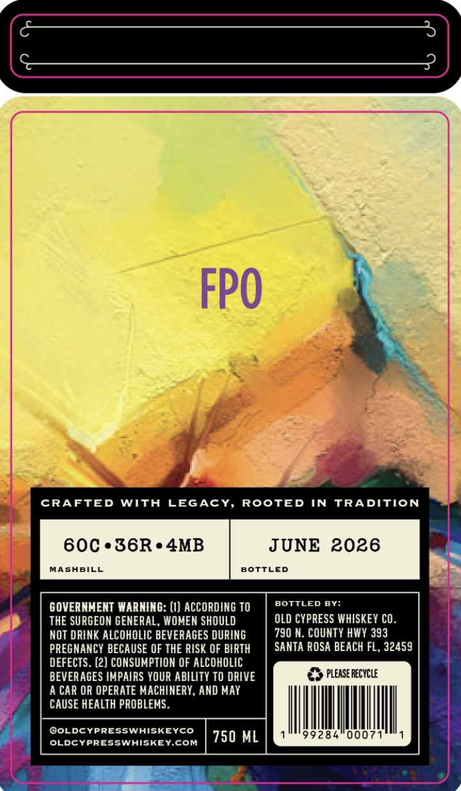
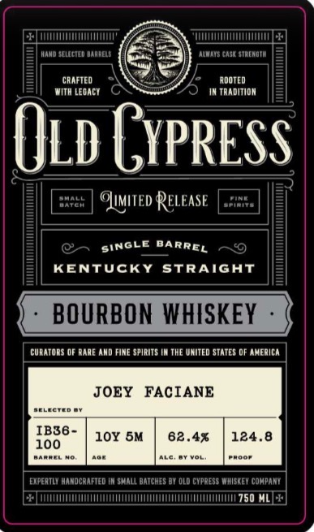

# TTB COLA Label Images - TTBID 26099001000900

**Brand Name:** OLD CYPRESS WHISKEY CO.

**Issue Date:** 05/04/2026

**Origin Code:** 22

**Product Class/Type:** 101

**Source:** [TTB Public COLA Registry](https://ttbonline.gov/colasonline/viewColaDetails.do?action=publicFormDisplay&ttbid=26099001000900)

## Label Images

### Back Label

### Front Label

## Extracted Label Text

*Text extracted via OCR - may contain errors*

**Detected Proof:** 124.8

### Back Label

FPO
CRAFTED
WIth
LEGAcY, ROOTED IN
TRADITION
60C . 36R.4MB
JUNE 2026
MASABILL
BOTTLED
GOVERNMENT WARNING: (I) ACCORDING TO
BOTTLED BY:
THE SURGEON GENERAL, WOMEN SHOULD
oLD CYPRESS WHISKEY CO.
NOT DRINK ALCOHOLIC BEVERAGES DURING
790 N. COUNTY HWY 393
PREGNANCY BECAUSE OF THE RISK OF BIRTH
SANTA ROSA BEACH FL, 32459
DEFECTS . (2) CONSUMPTION OF ALCOHOLIC
BEVERAGES IMPAIRS YOUR ABILITY TO DRIVE
pleaSE recycle
A CAR OR OPERATE MACHINERY , AND MAY
CAUSE HEALTH PROBLEMS
@OLDCYPRESSWHISKEYCO
750 ML
99284
0007
OLDCYPRESSWHISKEY.COM

### Front Label

electev baadels
oats case staeadta
CRAFTED
ADOTED
MITh LCdacT
TradITIDN
Old Gypress
Ehatt
Ouited Release
KENTUCKY
StRAIGAT
BOURBON WHISKEY
cunatodS OF Dane And FIME spirITS IN THE VAITEd STATES @F anericA
JOEY
FACIANE
BELICTTD
IB36 -
10Y 5M
62.4%
124.8
100
Aaercn
ExpeRTLI handcanfted
shall batchES D1 dld cypress Whiskev cohpani
750 ML
BARREL
SINGLE
