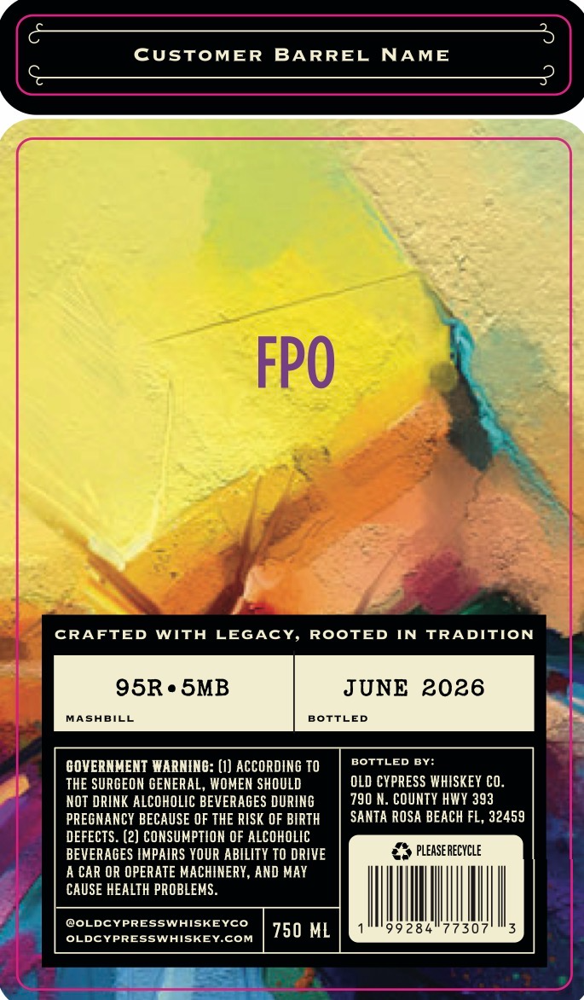
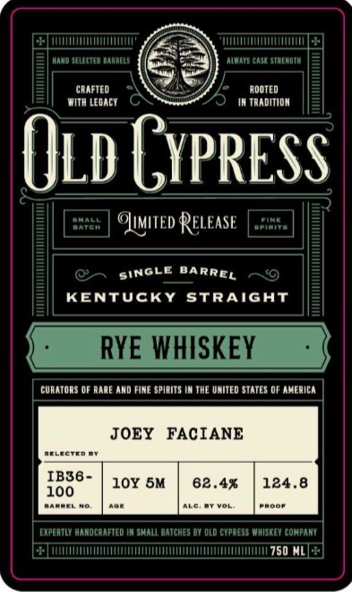

# TTB COLA Label Images - TTBID 26099001000901

**Brand Name:** OLD CYPRESS WHISKEY CO.

**Issue Date:** 04/29/2026

**Origin Code:** 22

**Product Class/Type:** 102

**Source:** [TTB Public COLA Registry](https://ttbonline.gov/colasonline/viewColaDetails.do?action=publicFormDisplay&ttbid=26099001000901)

## Label Images

### Back Label

### Front Label

## Extracted Label Text

*Text extracted via OCR - may contain errors*

**Detected Proof:** 82.4

### Back Label

CUSTOMER
BARREL
NAME
FPO
CRAFTED WITH LEGACY, ROOTED IN TRADITION
95R. SMB
JUNE 2026
MASABILL
BOTTLED
GOVERNMENT WARNING: (I) ACCORDING TO
BOTTLED BY:
THE SURGEON GENERAL, WOMEN SHOULD
OLD CYPRESS WHISKEY CO.
NOT DRINK ALCOHOLIC BEVERAGES DURING
790 N. COUNTY HWY 393
PREGNANCY BECAUSE OF THE RISK OF BIRTH
SANTA ROSA BEACH FL, 32459
DEFECTS . (2) CONSUMPTION OF ALCOHOLIC
BEVERAGES IMPAIRS YOUR ABILITY TO DRIVE
pleaserecycle
A CAR OR OPERATE MACHINERY, AND MAY
CAUSE HEALTH PROBLEMS.
@OLDCYPRESSWHISKEYCO
750 ML
99 284
307
OLDCYPRESSWAISKEY.COM

### Front Label

ILulLuliUAAHELa

case staeadtm
CRAFTED
RDOTED
MITh LEoAcT
TRADITIDN
Old GypRESS
Oatch
Oumtted Release
KENTUCKY StrAiGAT
RYE WHISKEY
curatonS OF rare ANd FIME spinItS IM ThE uhited statES df Aherica
JOEY
FACIANE
TCTEN
IB36 -
10Y 5M
82.4%
124.8
100
TareeL
Koot
ExpeRTLY handcanfted
shalL datcheS 0Y dLd cuprEss WisKEV compant
750 ML
SINGLE
BARREL
