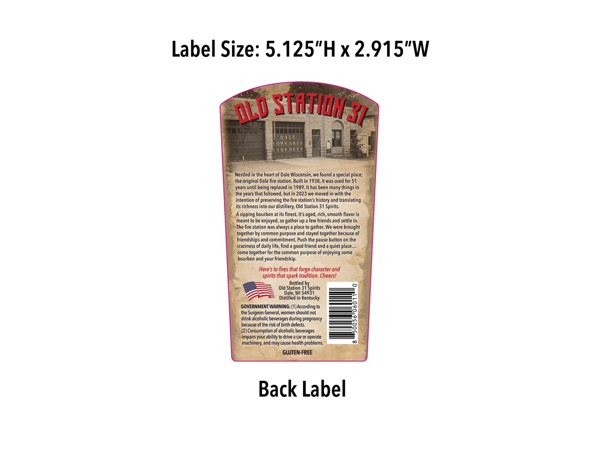
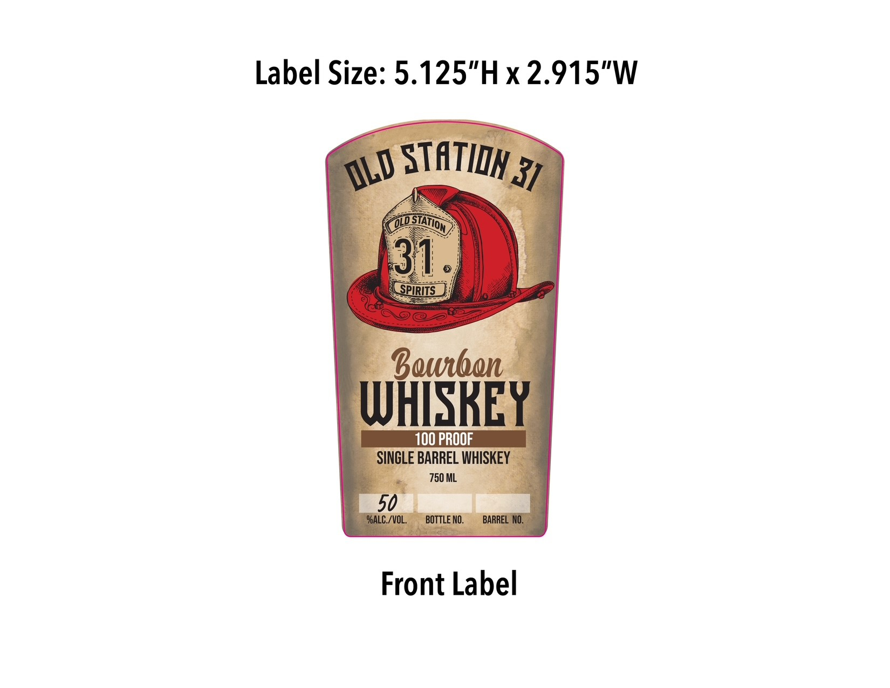

# TTB COLA Label Images - TTBID 26100001000004

**Brand Name:** OLD STATION 31

**Fanciful Name:** SINGLE BARREL

**Issue Date:** 04/15/2026

**Origin Code:** 48

**Product Class/Type:** 141

**Source:** [TTB Public COLA Registry](https://ttbonline.gov/colasonline/viewColaDetails.do?action=publicFormDisplay&ttbid=26100001000004)

## Label Images

### Back Label

### Front Label

## Extracted Label Text

*Text extracted via OCR - may contain errors*

**Detected Proof:** 100

### Back Label

Label Size: 5.125"Hx2.915"W
Stfflul3p
DALE
Ounsip
TEDETT
Nestled in the heart of Dale Wisconsin, we found
special place;
the original Dale fire station. Built in 1938,it was used for 51
years until being replaced in 1989.It has been many
the years that followed, but in 2023 we moved in with the
intention of preserving the fire station's history and translating
its richness into our distillery; Old Station 31 Spirits.
A sipping bourbon at its finest: It'$
rich, smooth flavor is
meant to be enjoyed, so gather up
few friends and settle in:
The fire station was always
place to
gather. We were brought
together by common purpose and stayed together because of
friendships and commitment: Push the pause button on the
craziness of daily life, find
friend and a quiet place_
come
together for the common purpose of enjoying some
bourbon and your friendship:
Here s to fires that forge character and
spirits that spark tradition: Cheers!
Bottled
bypirits
Old Station 31
Dale, WI 54931
Distilled in Kentucky
GOVERNMENT WARNING: (1) According to
the Surgeon Genera
women should not
drink alcoholic beverages during pregnancy
because of the risk of birth defects
5
(2) Consumption of alcoholic beverages
impairs your ability to drive
caror operate
machinery;and may cause health problems
GLUTEN-FREE
Back Label
dld
things '
aged;
good -

### Front Label

Label Size: 5.125"Hx2.915"W
STATIDK 37
31
SPIRITS
Bewbon
WHISREY
100 PROOF
SINGLE BARREL WHISKEY
750 ML
50
"ALC /VOL:
BOTTLE NO.
BARREL NO.
Front Label
@LD
01@Sintion
