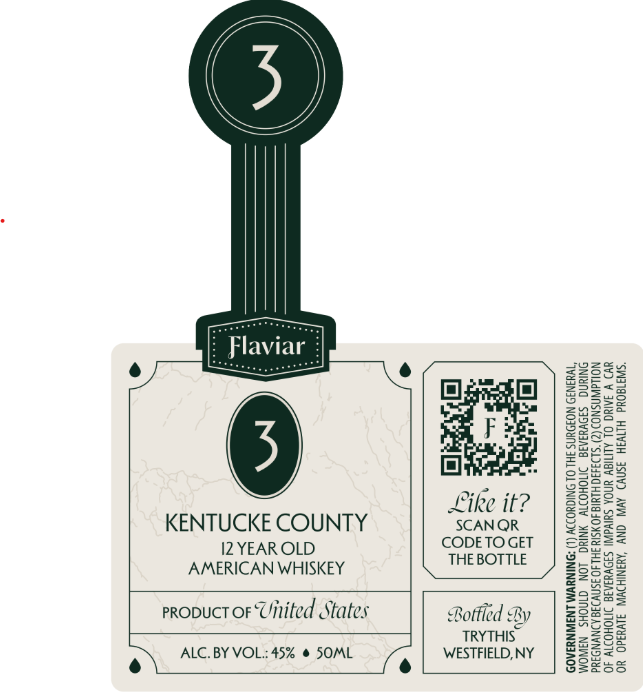

# TTB COLA Label Images - TTBID 26100001000082

**Brand Name:** FLAVIAR

**Issue Date:** 04/10/2026

**Origin Code:** 02

**Product Class/Type:** 140

**Source:** [TTB Public COLA Registry](https://ttbonline.gov/colasonline/viewColaDetails.do?action=publicFormDisplay&ttbid=26100001000082)

## Label Images

### Front Label

## Extracted Label Text

*Text extracted via OCR - may contain errors*

**Detected Proof:** 90

### Front Label

‘SngOud Hin
WD V ARO OL
Nouawinsno9 (2)
SNRING SIOVHIAIE IVOHOI YNIKG LON. GTHOHS N3WOM
*y3N39 NOBOWNS 3HL OL SNICHODDY (1) DNINIWM ANSWNREAOD

39NV) AVN ONY ‘AYBNIKOWIN, 31¥8340. 40.
 UNOA Suva] S3O¥WAIA DITOHONY 40
0 HIYIS 40SIa3H1 40 3f1V938 ANYNDZA

a culls =
OBE Sexe ]| Srz
e Ook || = rao

4 ie 3 ZEO Sea
fee “S22 it
Syou SFa

240 era
Bae so BS

@

ed States

AMERICAN WHISKEY
ALC. BY VOL.: 45% @ SOML

KENTUCKE COUNTY
I2YEAR OLD

PRODUCT OF Uilile
