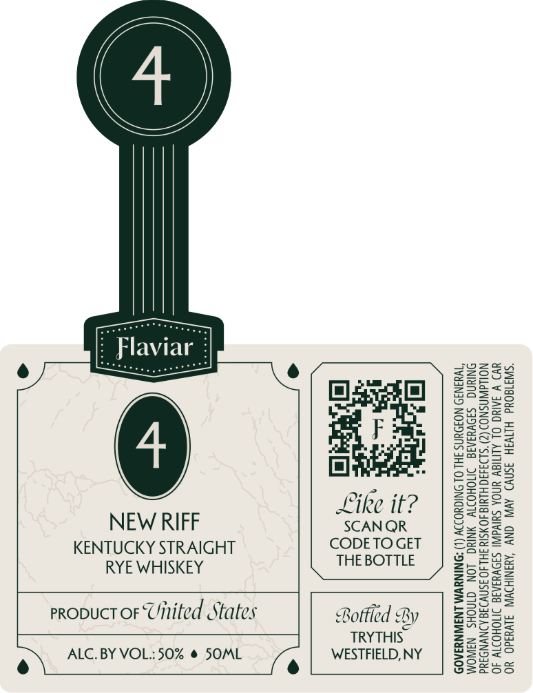

# TTB COLA Label Images - TTBID 26100001000086

**Brand Name:** FLAVIAR

**Issue Date:** 04/17/2026

**Origin Code:** 02

**Product Class/Type:** 112

**Source:** [TTB Public COLA Registry](https://ttbonline.gov/colasonline/viewColaDetails.do?action=publicFormDisplay&ttbid=26100001000086)

## Label Images

### Front Label

## Extracted Label Text

*Text extracted via OCR - may contain errors*

**Detected Proof:** 100

### Front Label

iar

z
a:

‘sa 180¥d 9 AV. ONY “ABNIHDWIN 318d 80
WD V 3Ania  UNOA Suva] S3DVAAIA DNTOHONY 40
Nouawinsno (2) HL 40 10 35fV38 ADNVNOA

SNRING SIOVHIAIE NOHO ON. GTNOHS NaWNOM
*yBN39 NOBOWNS HL OL SNIGHODDY (1) DNINIWM LNSWNEAOD

ty || 2 2
“OF Pa
OoE || 2ia9
zeo || Sea
Zna||Soe
¥82/| SF
SF yj|S
° °

NEW RIFF
KENTUCKY STRAIGHT
RYE WHISKEY
propuct or Uinited States

ALC. BY VOL.:50% @ SOML
re
