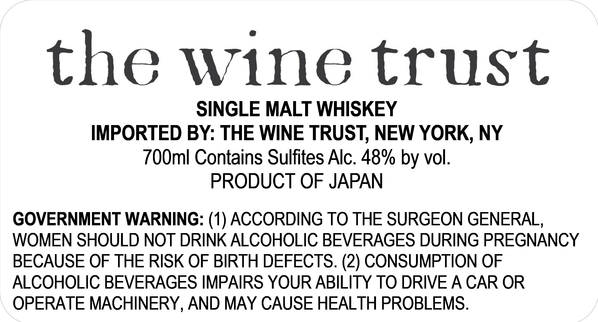

# TTB COLA Label Images - TTBID 26100001000094

**Brand Name:** THE WINE TRUST

**Issue Date:** 04/10/2026

**Origin Code:** 59

**Product Class/Type:** 118

**Source:** [TTB Public COLA Registry](https://ttbonline.gov/colasonline/viewColaDetails.do?action=publicFormDisplay&ttbid=26100001000094)

## Label Images

### Label 1

## Extracted Label Text

*Text extracted via OCR - may contain errors*

### Label 1

the wine trust

SINGLE MALT WHISKEY

IMPORTED BY: THE WINE TRUST, NEW YORK, NY

700ml Contains Sulfites Alc. 48% by vol.

PRODUCT OF JAPAN

GOVERNMENT WARNING: (1) ACCORDING TO THE SURGEON GENERAL,

WOMEN SHOULD NOT DRINK ALCOHOLIC BEVERAGES DURING PREGNANCY

BECAUSE OF THE RISK OF BIRTH DEFECTS. (2) CONSUMPTION OF

ALCOHOLIC BEVERAGES IMPAIRS YOUR ABILITY TO DRIVE A CAR OR

OPERATE MACHINERY, AND MAY CAUSE HEALTH PROBLEMS.
