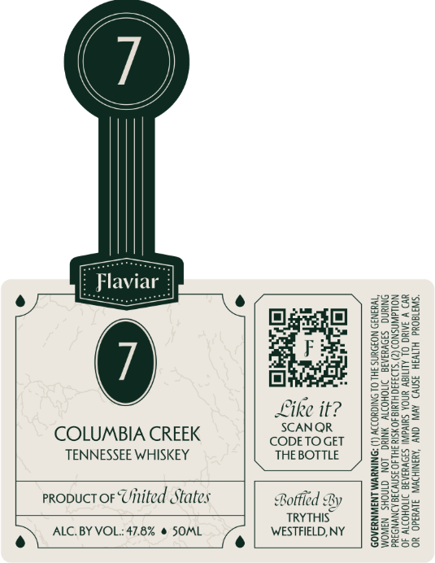

# TTB COLA Label Images - TTBID 26100001000100

**Brand Name:** FLAVIAR

**Issue Date:** 04/10/2026

**Origin Code:** 02

**Product Class/Type:** 140

**Source:** [TTB Public COLA Registry](https://ttbonline.gov/colasonline/viewColaDetails.do?action=publicFormDisplay&ttbid=26100001000100)

## Label Images

### Front Label

## Extracted Label Text

*Text extracted via OCR - may contain errors*

**Detected Proof:** 95.6

### Front Label

/

\{

\

\\

Flaviar

er

S22

2258

2283

e/

Bgxthl

ga

Ssecg

Za22=

ae

ee

828.

gee.

3928

Fated

SaS)

ee

gee

=

ER

ses.

22s

Like it?

BE

SoES=

2B 0

SCANQR

=e

COLUMBIA CREEK

CODETOGET

gS2

TENNESSEE WHISKEY

THE BOTTLE

g°29

SEOs

Z2Ss=

25528

g2e:

qsae

propuct or Uinited States

ge

eke

eit

BS

Se

Bottled By

Bese

TRYTHIS

25395

2-252

252

gS

o> ALC. BY VOL.: 47.8% @ SOML

)

WESTFIELD, NY

8Se65

32255
