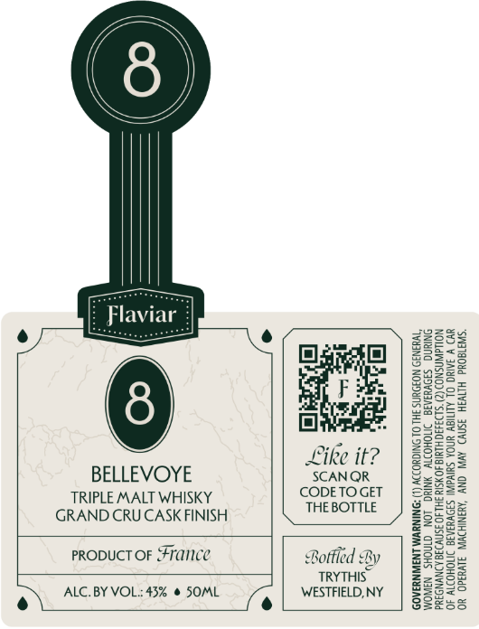

# TTB COLA Label Images - TTBID 26100001000102

**Brand Name:** FLAVIAR

**Issue Date:** 04/13/2026

**Origin Code:** 51

**Product Class/Type:** 118

**Source:** [TTB Public COLA Registry](https://ttbonline.gov/colasonline/viewColaDetails.do?action=publicFormDisplay&ttbid=26100001000102)

## Label Images

### Front Label

## Extracted Label Text

*Text extracted via OCR - may contain errors*

**Detected Proof:** 86

### Front Label

{/

\{

\

\

7

ers

e

eu

S22

2238

2233

Baath

gaz

Geers

2225

ae

ee

828.

gee.

3825

28a

Fated

Eo!

=f

Dee

ey

oy

=s

ER

Soe

BonS~

ss

Like it?

BEE

S222

BELLEVOYE

SCANQR

=e

TRIPLE MALT WHISKY

CODETOGET

gS=

GRAND CRU CASK FINISH

THE BOTTLE

tle]

Z2Ss2

25528

5928

qsae

PRODUCT OF France

235:

Beke

Bo

Sa

Bottled By

TRYTHIS

2-252

Ss5se

WESTFIELD, NY

£5395

252

gs

e) ALC. BY VOL: 43% @ SOML

)

8Se65

32255
