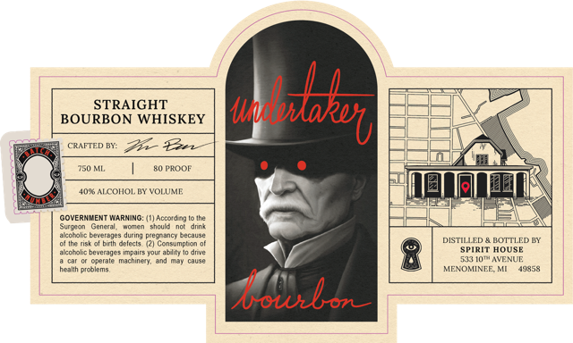

# TTB COLA Label Images - TTBID 26100001000108

**Brand Name:** UNDERTAKER BOURBON

**Issue Date:** 04/20/2026

**Origin Code:** 06

**Product Class/Type:** 101

**Source:** [TTB Public COLA Registry](https://ttbonline.gov/colasonline/viewColaDetails.do?action=publicFormDisplay&ttbid=26100001000108)

## Label Images

### Label 1

## Extracted Label Text

*Text extracted via OCR - may contain errors*

**Detected Proof:** 80

### Label 1

STRAIGHT
BOURBON WHISKEY
CRAFTED BY:
71 En
750 ML
R0 ProoF
40% AICOHOI
VOLUME
GOVERMWENT WARNING: (I] Accoidng lo Ihe
Iscnen
t
Khoig
uiccrol beveladuy Juring pcecruncy decuuse
alitirh cclech
Consmnhan
DISTILLED
adn
Su
dSE
ilccrolz bcvcrwocs impnirs "jur ablity
pperale
machinet
513 [OTAVENUE
hcallh plonicms
MEYOMINEE M
49358
boiubon
Obtbd
Sutao
~Cuid
