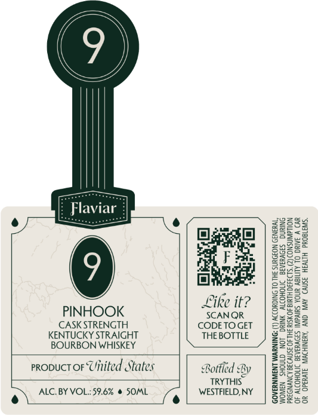

# TTB COLA Label Images - TTBID 26100001000110

**Brand Name:** FLAVIAR

**Issue Date:** 04/13/2026

**Origin Code:** 02

**Product Class/Type:** 101

**Source:** [TTB Public COLA Registry](https://ttbonline.gov/colasonline/viewColaDetails.do?action=publicFormDisplay&ttbid=26100001000110)

## Label Images

### Front Label

## Extracted Label Text

*Text extracted via OCR - may contain errors*

**Detected Proof:** 119.2

### Front Label

‘sa 180¥d

WAH SN) AVN ONY ‘AYBNIHOWIN, IYO. YO.

THE BOTTLE
By
TRYTHIS
WESTFIELD, NY

Bottled

SCANQR
CODETOGET

eo

PINHOOK
CASK STRENGTH
KENTUCKY STRAIGHT
BOURBON WHISKEY

propuct or United States

ALC. BY VOL:59.6% @ SOML
e\
