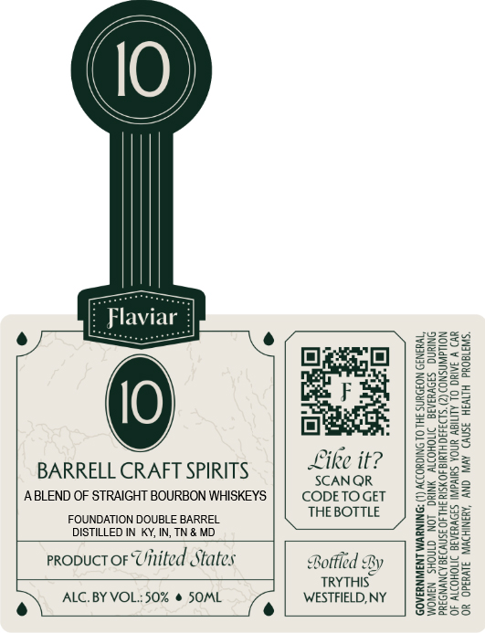

# TTB COLA Label Images - TTBID 26100001000114

**Brand Name:** FLAVIAR

**Issue Date:** 04/23/2026

**Origin Code:** 02

**Product Class/Type:** 121

**Source:** [TTB Public COLA Registry](https://ttbonline.gov/colasonline/viewColaDetails.do?action=publicFormDisplay&ttbid=26100001000114)

## Label Images

### Front Label

## Extracted Label Text

*Text extracted via OCR - may contain errors*

### Front Label

Like it?

ALC. BY VOL.;50% @ SOML
\ e

BARRELL CRAFT SPIRITS SCANOR
ABLEND OF STRAIGHT BOURBON WHISKEYS | | CODE TO GET
FOUNDATION DOUBLE BARREL THEBOTTLE
DISTILLED IN KY, IN, TN & MD_
propuct oF United States Bottled By
TRYTHIS
WESTFIELD, NY

GOVERNMENT WARNING: (1) ACCORDING TO THE SURGEON GENERAL,
