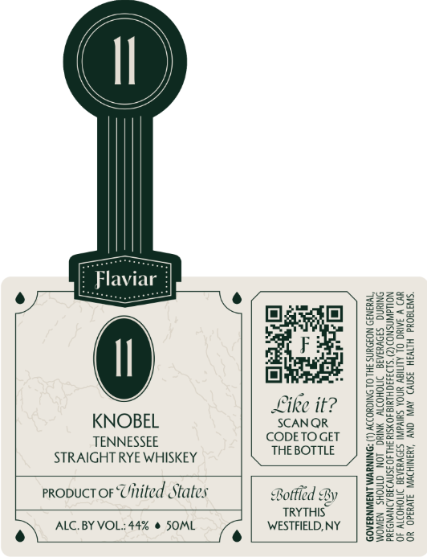

# TTB COLA Label Images - TTBID 26100001000121

**Brand Name:** FLAVIAR

**Issue Date:** 04/13/2026

**Origin Code:** 02

**Product Class/Type:** 102

**Source:** [TTB Public COLA Registry](https://ttbonline.gov/colasonline/viewColaDetails.do?action=publicFormDisplay&ttbid=26100001000121)

## Label Images

### Front Label

## Extracted Label Text

*Text extracted via OCR - may contain errors*

**Detected Proof:** 88

### Front Label

(II)

[ Flaviar |
Oe O“NS ( tasecarmy ) SESE
ae aeese
A egee=
|e
He gage
Like it? | 3225:
KNOBEL SCANQR ERE
TENNESSEE copeTocer | =s¢==
STRAIGHT RYE WHISKEY THEBOTTIE ) 25598
F285
PR Tre 59282
propuct or Uitited States Bottled By | BEBSe
TRYTHS «=| 22285
ALC. BY VOL: 44% # SOML WESTFIELD.NY | 252°
