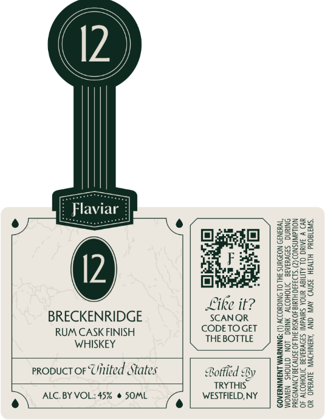

# TTB COLA Label Images - TTBID 26100001000127

**Brand Name:** FLAVIAR

**Issue Date:** 04/13/2026

**Origin Code:** 02

**Product Class/Type:** 140

**Source:** [TTB Public COLA Registry](https://ttbonline.gov/colasonline/viewColaDetails.do?action=publicFormDisplay&ttbid=26100001000127)

## Label Images

### Front Label

## Extracted Label Text

*Text extracted via OCR - may contain errors*

**Detected Proof:** 90

### Front Label

\\

//

\\

\{

})

})

7

e

eu

S25

2238

2283

Egathl

a=

Geers

23

Fac}

2225

ae

Bee

Fe

828

S36

gee.

bi

Fated

ee

Eo)

gee

hat

“é

Svzsa

sie

33

2353

5oeS=

gees

Like it?

FEE

B2e5

BRECKENRIDGE

SCANQR

32

See

RUM CASK FINISH

CODETOGET

252

THE BOTTLE

SEOs

Fane

WHISKEY

25528

z=

59282

qsae

proouct oF Uitited States

ge

Se

Bottled By

TRYTHIS

S553

z=

3c

e) ALC. BY VOL:45% © SOML

e

WESTFIELD, NY

SSes65

Se ee
