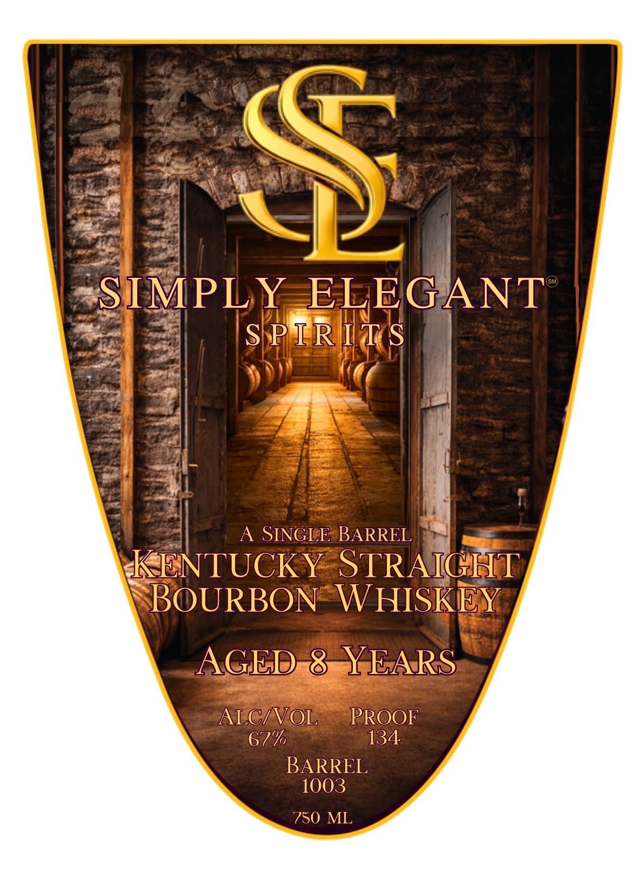
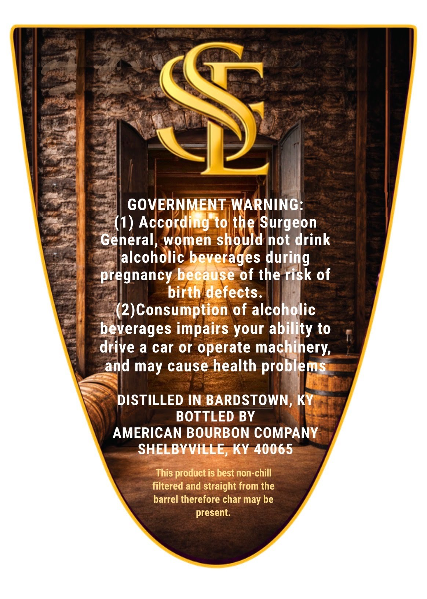

# TTB COLA Label Images - TTBID 26100001000152

**Brand Name:** SIMPLY ELEGANT

**Issue Date:** 04/10/2026

**Origin Code:** 22

**Product Class/Type:** 101

**Source:** [TTB Public COLA Registry](https://ttbonline.gov/colasonline/viewColaDetails.do?action=publicFormDisplay&ttbid=26100001000152)

## Label Images

### Label 1

### Label 2

## Extracted Label Text

*Text extracted via OCR - may contain errors*

**Detected Proof:** 134

### Label 1

S
SIMPLY
ELEGANT
S P IRITS
A SINGLE BARREL
KENTUCKY STRAIGHT
BOURBON WHISKEY
AGED & YEARS
ALCIVOL
PROOF
67%
134
BARREL
1003
750 ML

### Label 2

$
GOVERNMENT WARNING
(1) According to the Surgeon
General
women should not drink
alcoholic beverages during
pregnancy because of the risk of
birth defects_
(2)Consumption of alcoholic
beverages impairs your ability to
drive a car or operate machinery;
and
cause health problems
DISTILLED IN BARDSTOWN, KY
BOTTLED BY
AMERICAN BOURBON COMPANY
SHELBYVILLE, KY 40065
This product is best non-chill
filtered and straight from the
barrel therefore char may be
present:
may
