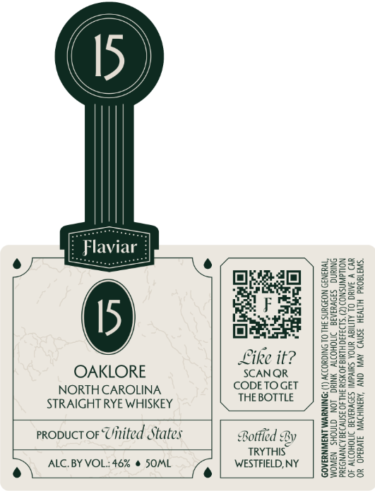

# TTB COLA Label Images - TTBID 26100001000154

**Brand Name:** FLAVIAR

**Issue Date:** 04/13/2026

**Origin Code:** 02

**Product Class/Type:** 102

**Source:** [TTB Public COLA Registry](https://ttbonline.gov/colasonline/viewColaDetails.do?action=publicFormDisplay&ttbid=26100001000154)

## Label Images

### Front Label

## Extracted Label Text

*Text extracted via OCR - may contain errors*

**Detected Proof:** 92

### Front Label

(15 }

[ Flaviar |
eye (Ne g888s
Bielel | co3ce
ria | Sece2
opaead eyEsy
Like it? | 8822
OAKLORE SCANQR ERE
NORTH CAROLINA CODETOGET | Sge==
STRAIGHT RYE WHISKEY THEBOTTLE ) 25598
znges
pene 59282
propuct oF Uitited States Botfied By | FEBS we
TRYTHS = | 22286
ALC. BY VOL: 46% @ SOML WESTFIELD, NY S25=°
