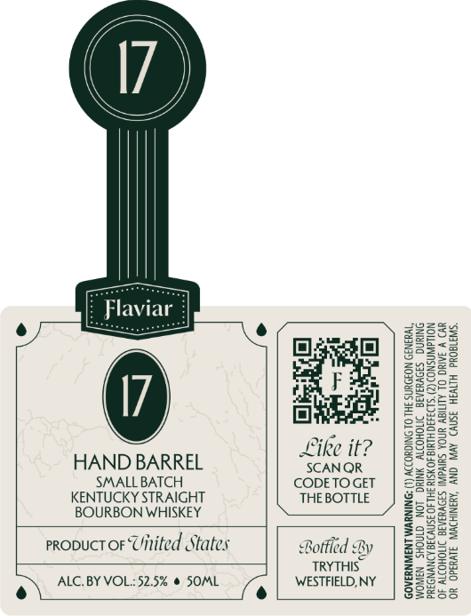

# TTB COLA Label Images - TTBID 26100001000157

**Brand Name:** FLAVIAR

**Issue Date:** 04/14/2026

**Origin Code:** 02

**Product Class/Type:** 101

**Source:** [TTB Public COLA Registry](https://ttbonline.gov/colasonline/viewColaDetails.do?action=publicFormDisplay&ttbid=26100001000157)

## Label Images

### Front Label

## Extracted Label Text

*Text extracted via OCR - may contain errors*

### Front Label

a

Like it?

ALC. BY VOL::52.5% @ SOML
e\

HAND BARREL SCANQR
SMALLBATCH CODETOGET
KENTUCKY STRAIGHT THE BOTTLE
BOURBON WHISKEY
proouct or Uinited States Bottled By
TRYTHIS”

WESTFIELD, NY

GOVERNMENT WARNING: (1) ACCORDING TO THE SURGEON GENERAL,
