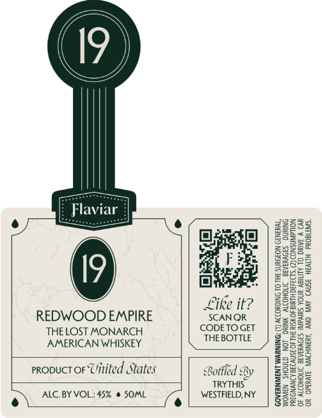

# TTB COLA Label Images - TTBID 26100001000174

**Brand Name:** FLAVIAR

**Issue Date:** 04/13/2026

**Origin Code:** 02

**Product Class/Type:** 140

**Source:** [TTB Public COLA Registry](https://ttbonline.gov/colasonline/viewColaDetails.do?action=publicFormDisplay&ttbid=26100001000174)

## Label Images

### Front Label

## Extracted Label Text

*Text extracted via OCR - may contain errors*

**Detected Proof:** 90

### Front Label

[ Flaviar |
Day eam © (amcor ) SEES!
are g2358
Bh seal | 2cc-=
ive. | = oe5
REDWOOD EMPIRE SCANQR g.S20
THE LOST MONARCH Gereuedar || Sas
AMERICAN WHISKEY THEBOTTIE ) 25598
eee
a pipette 59282
propuct oF Uitited States Borfied By | ESBS e
TRYTHIS z22c8
ALC. BY VOL: 45% @ SOML WESTFIELD, NY S25=°
