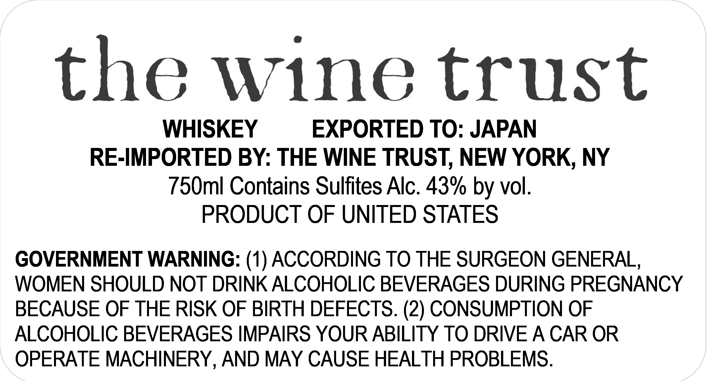

# TTB COLA Label Images - TTBID 26100001000185

**Brand Name:** THE WINE TRUST

**Issue Date:** 04/13/2026

**Origin Code:** 02

**Product Class/Type:** 140

**Source:** [TTB Public COLA Registry](https://ttbonline.gov/colasonline/viewColaDetails.do?action=publicFormDisplay&ttbid=26100001000185)

## Label Images

### Label 1

## Extracted Label Text

*Text extracted via OCR - may contain errors*

### Label 1

the wine trust
WHISKEY
EXPORTED TO: JAPAN
RE-IMPORTED BY: THE WINE TRUST, NEW YORK, NY
750ml Contains Sulfites Alc. 43% by vol:
PRODUCT OF UNITED STATES
GOVERNMENT WARNING: (1) ACCORDING TO THE SURGEON GENERAL,
WOMEN SHOULD NOT DRINK ALCOHOLIC BEVERAGES DURING PREGNANCY
BECAUSE OF THE RISK OF BIRTH DEFECTS. (2) CONSUMPTION OF
ALCOHOLIC BEVERAGES IMPAIRS YOUR ABILITY TO DRIVE A CAR OR
OPERATE MACHINERY AND MAY CAUSE HEALTH PROBLEMS.
