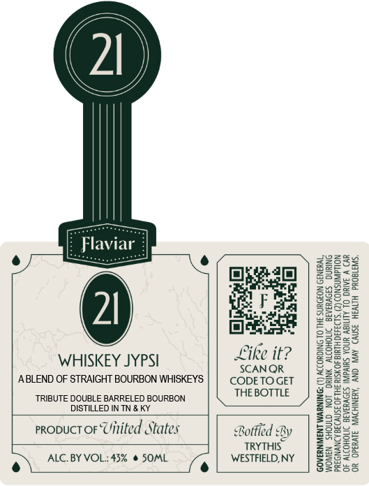

# TTB COLA Label Images - TTBID 26100001000186

**Brand Name:** FLAVIAR

**Issue Date:** 04/24/2026

**Origin Code:** 02

**Product Class/Type:** 121

**Source:** [TTB Public COLA Registry](https://ttbonline.gov/colasonline/viewColaDetails.do?action=publicFormDisplay&ttbid=26100001000186)

## Label Images

### Front Label

## Extracted Label Text

*Text extracted via OCR - may contain errors*

**Detected Proof:** 86

### Front Label

WHISKEY JYPSI

ea

ike it?

SCANQR
ABLEND OF STRAIGHT BOURBON WHISKEYS | | CODETO GET
TRIBUTE DOUBLE BARRELED BOURBON Unbeinne
DISTILLED IN TN & KY
proouctor Uinited States Bottled By
TRYTHIS

ALC. BY VOL: 43% @ SOML
e\

fe

WESTFIELD, NY

ECTS. (2) CONSUMPTION

‘OR OPERATE MACHINERY, AND MAY CAUSE HEALTH PROBLEMS,
