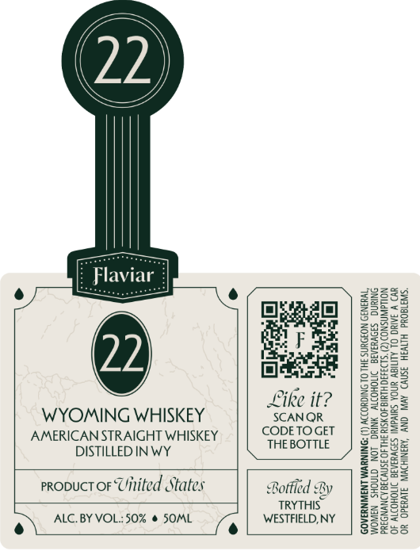

# TTB COLA Label Images - TTBID 26100001000194

**Brand Name:** FLAVIAR

**Issue Date:** 04/13/2026

**Origin Code:** 02

**Product Class/Type:** 109

**Source:** [TTB Public COLA Registry](https://ttbonline.gov/colasonline/viewColaDetails.do?action=publicFormDisplay&ttbid=26100001000194)

## Label Images

### Front Label

## Extracted Label Text

*Text extracted via OCR - may contain errors*

**Detected Proof:** 100

### Front Label

Flaviai

=

eens

Like it?
WYOMING WHISKEY SCANOR
AMERICAN STRAIGHT WHISKEY CODETO GET

DISTILLED INWY THE BOTTLE
proouct or Uinited States Bottled By
TRYTHIS”

‘OR OPERATE MACHINERY, AND MAY CAUSE HEALTH PROBLEMS,

OF ALCOHOLIC BEVERAGES IMPAIRS YOUR ABIL

ALC. BY VOL: 50% @ SOML WESTFIELD, NY
e\ fe
