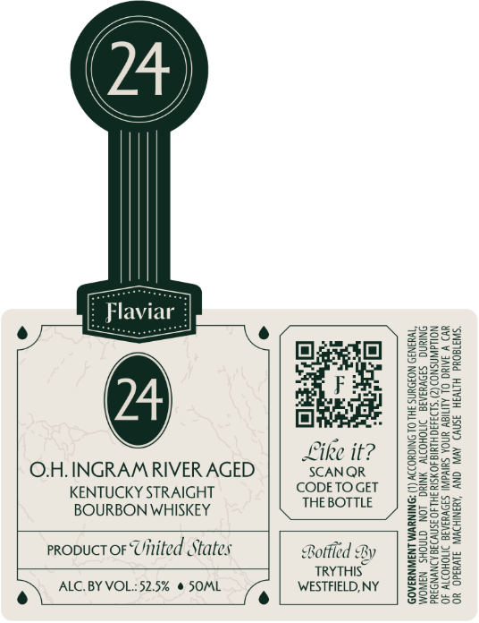

# TTB COLA Label Images - TTBID 26100001000205

**Brand Name:** FLAVIAR

**Issue Date:** 06/03/2026

**Origin Code:** 02

**Product Class/Type:** 101

**Source:** [TTB Public COLA Registry](https://ttbonline.gov/colasonline/viewColaDetails.do?action=publicFormDisplay&ttbid=26100001000205)

## Label Images

### Front Label

## Extracted Label Text

*Text extracted via OCR - may contain errors*

### Front Label

//

\\

\{

})

see

e

eu

aa

Z23e

2233

Baath

a=

Geers

Za22=

ae

ee

828.

gee.

3828

28a

Fated

Eo!

a

Dee

ey

ay

=s

ER

Soe

ZonS~

ss

Like it?

B2sl5

Feary

O.H. INGRAM RIVER AGED

SCANQR

=e

KENTUCKY STRAIGHT

CODETOGET

gS=

BOURBON WHISKEY

THE BOTTLE

tle]

=az

Z2Ss2

25528

5928

qsae

proouct or Uinited States

235:

eke

Bo

Sa

Bottled By

TRYTHIS

2-252

S553

WESTFIELD, NY

£5295

252

5

e) ALC. BY VOL::52.5% @ SOML le

8Se65

32255
