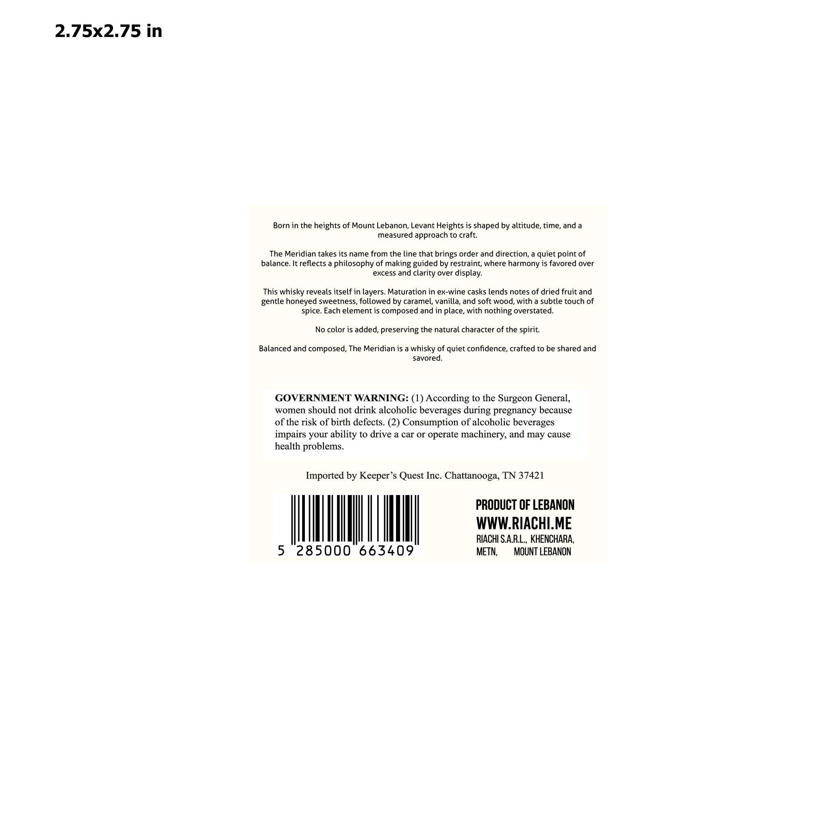
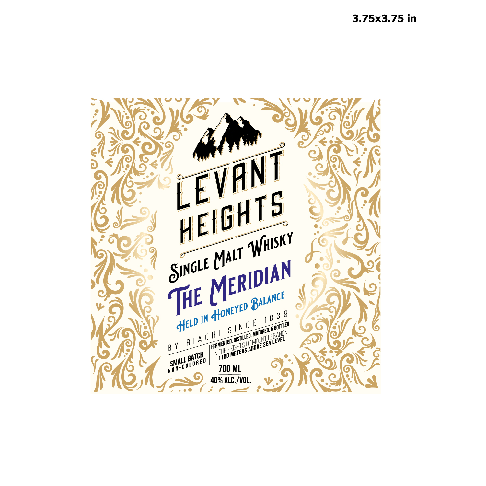

# TTB COLA Label Images - TTBID 26100001000256

**Brand Name:** LEVANT HEIGHTS SINGLE MALT WHISKY

**Fanciful Name:** THE MERIDIAN

**Issue Date:** 04/13/2026

**Origin Code:** 5F

**Product Class/Type:** 118

**Source:** [TTB Public COLA Registry](https://ttbonline.gov/colasonline/viewColaDetails.do?action=publicFormDisplay&ttbid=26100001000256)

## Label Images

### Back Label

### Front Label

## Extracted Label Text

*Text extracted via OCR - may contain errors*

**Detected Proof:** 80

### Back Label

2.75x2.75 in
Born in the heights of Mount Lebanon, Levant Heights is shaped by altitude, time, and a
measured approach to craft:
The Meridian takes its name from the line that brings order and direction, a quiet point of
balance It reflects a philosophy of making guided by restraint; where harmony is favored over
excess and
over display:
This whisky reveals itself in layers. Maturation in ex-wine casks lends notes of dried fruit and
honeyed sweetness, followed by caramel, vanilla, and soft wood, with a subtle touch of
spice. Each element is composed and in place, with nothing overstated.
No color is added, preserving the natural character of the spirit:
Balanced and composed, The Meridian is a whisky of quiet confidence, crafted to be shared and
savored_
GOVERNMENT WARNING: (1) According to the Surgeon General;
women should not drink alcoholic beverages during pregnancy because
of the risk of birth defects. (2) Consumption of alcoholic beverages
impairs your ability to drive a car O operate machinery, and may cause
health problems_
Imported by Keeper's Quest Inc. Chattanooga, TN 37421
PRODUCT OF LEBANON
WWW_RIACHI.ME
RIACHI SARL,, KHENCHARA,
5
285000
663409
METN;
MOUNT LEBANON
clarity
gentle

### Front Label

3.75x3.75 in
TE
3
9
IN
1 8
c E
SEA
3
IN
700 ML
40% ALC /VOL.
LEVANT
HEIGHTS
WWhisky
MAlt
SINGLE
MERIDIAN
BALANCE
HONEYED_
HELD
1 BOTTLED
Sin
MATURED; .
C H /
EBANON
DISTILLED;,
SaBove SEA
R / A
ZEVEL
'FERMENTED;,
'THE HEIHTS L
'METERS ,
BATCH
1150 _
SMALL
'0 L 0 RE D
Mon-=
