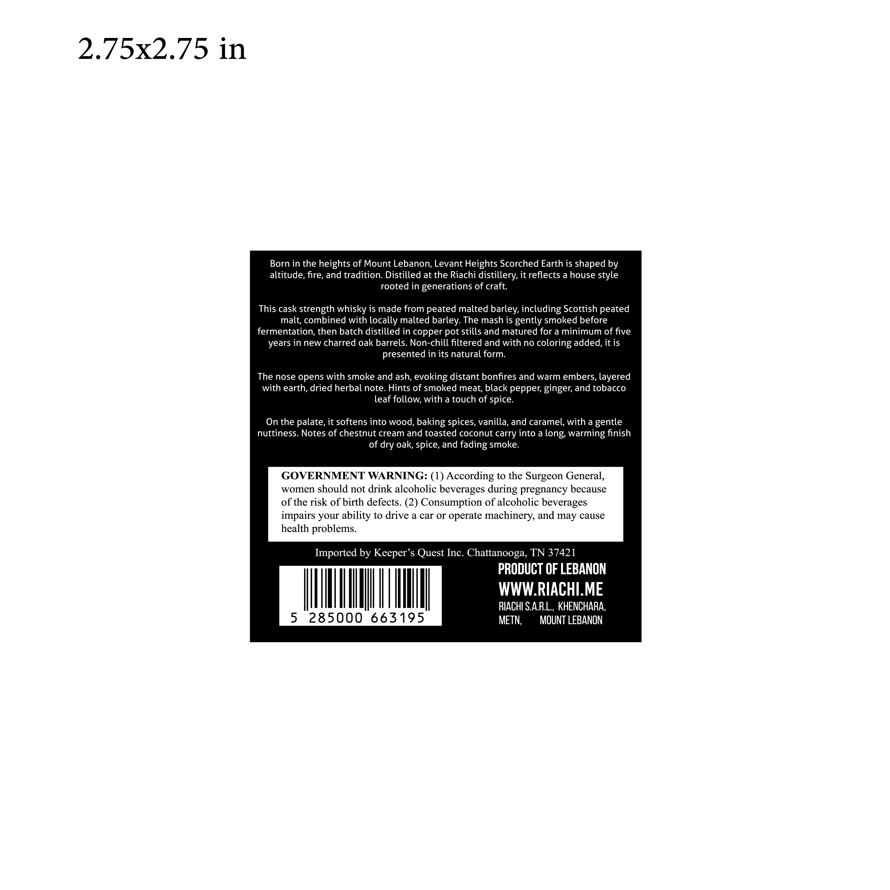
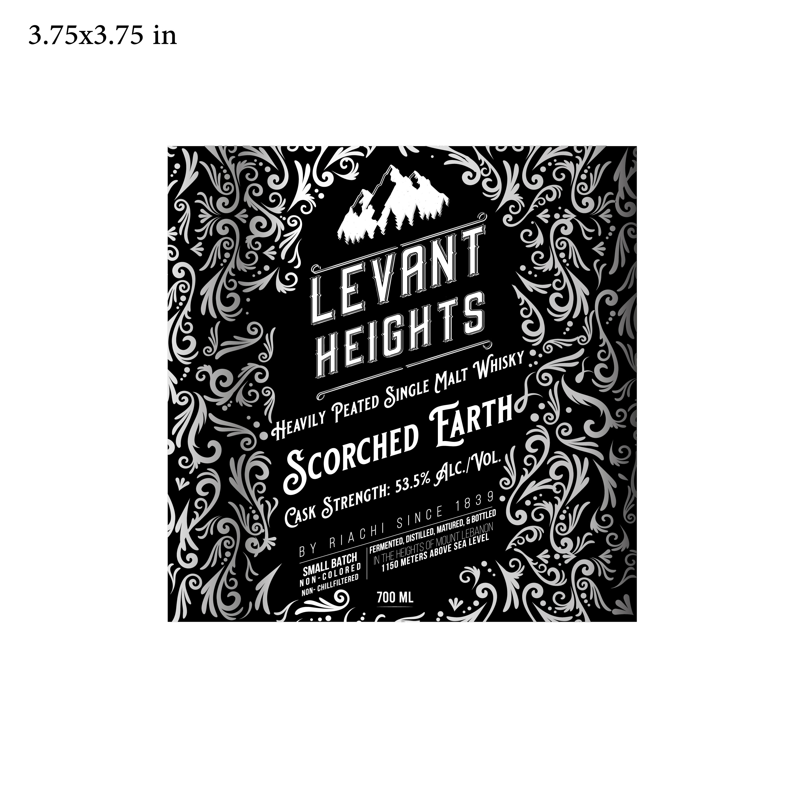

# TTB COLA Label Images - TTBID 26100001000276

**Brand Name:** LEVANT HEIGHT HEAVILY PEATED SINGLE MALT WHISKY

**Fanciful Name:** SCORCHED EARTH

**Issue Date:** 04/17/2026

**Origin Code:** 5F

**Product Class/Type:** 118

**Source:** [TTB Public COLA Registry](https://ttbonline.gov/colasonline/viewColaDetails.do?action=publicFormDisplay&ttbid=26100001000276)

## Label Images

### Back Label

### Front Label

## Extracted Label Text

*Text extracted via OCR - may contain errors*

**Detected Proof:** 107

### Back Label

2.75x2.75 in
Born in the heights of Mount Lebanon, Levant Heights Scorched Earth is shaped by
altitude, fire, and tradition: Distilled at the Riachi distillery, it reflects a house style
rooted in generations of craft.
This cask strength whisky is made from peated malted barley, including Scottish peated
malt; combined with locally malted barley: The mash is gently smoked before
fermentation, then batch distilled in copper pot stills and matured for a minimum of five
years in new charred oak barrels. Non-chill filtered and with no coloring added, it is
presented in its natural form:
The nose opens with smoke and ash, evoking distant bonfires and warm embers, layered
with earth, dried herbal note Hints of smoked meat, black pepper; ginger; and tobacco
leaf follow; with a touch of spice:
On the palate, it softens into wood, baking spices, vanilla, and caramel; with a gentle
nuttiness
Notes of chestnut cream and toasted coconut carry into a long; `
warming finish
of dry oak; spice, and fading smoke_
GOVERNMENT WARNING: (1) According to the Surgeon General,
women should not drink alcoholic beverages during pregnancy because
of the risk ofbirth defects. (2) Consumption of alcoholic beverages
impairs your ability to drive a car O operate machinery, and may cause
health problems.
Imported by Keeper's Quest Inc. Chattanooga, TN 37421
PRODUCT OF LEBANON
WWWRIACHIME
RIACHI SA.RL,, KHENCHARA,
5
285000
663195
METN;
MOUNT LEBANON

### Front Label

3.75x3.75 in
3 9
8
OF
INTHEE
NO n
700 ML
LEVANT
HEIGHTS
Whisky
MALT
SINGLE
PEATeD
FARTHc
HEAVILY
ScoRcHED
Glc_/VoL
53.5%
CTRENGTH:
1 8
CASk
S / N C E
 BOTTLED
MATURED,
LEBANON
R |A C H /
DISTILLED;
MOUNTC
LEVEL
'FERMENTED, _
SEA
HEIGHTS C
B Y
ABOVE
METERS ,
BATCH
1150 .
SMALL
c0L ORE D
CHILLFILTERED
NON- ~
