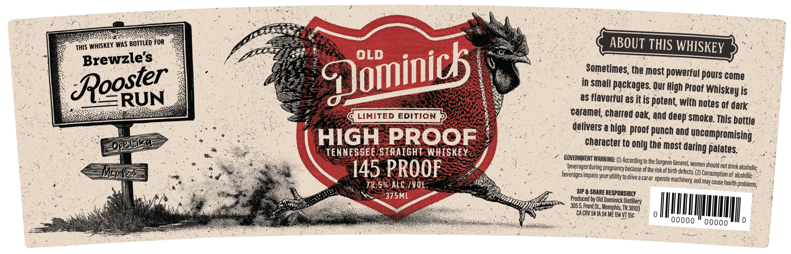
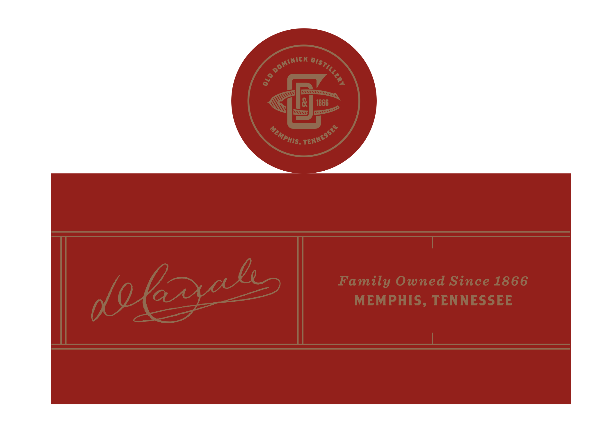

# TTB COLA Label Images - TTBID 26100001000478

**Brand Name:** OLD DOMINICK

**Fanciful Name:** ROOSTER RUN

**Issue Date:** 04/27/2026

**Origin Code:** 43

**Product Class/Type:** 109

**Source:** [TTB Public COLA Registry](https://ttbonline.gov/colasonline/viewColaDetails.do?action=publicFormDisplay&ttbid=26100001000478)

## Label Images

### Label 1

### Label 2

## Extracted Label Text

*Text extracted via OCR - may contain errors*

**Detected Proof:** 145

### Label 1

ThIS WHISKEy Was BOTTLED FoR
ABOUT THIS WHISKEY
Brewzle's
Sometimes, the most powerful pours come
Roozier
in small packages: Qur High Proof '
is
as flavofful as it is potent with notes Of
dark
LIMITED EDITION
caramel chanred oak and deep smoke This bottle
delivers a high proof punch and
HIGH
PROOF
character to only the most
uncompromising
TENNESSEE STRAIGHT WHISKEY
palates
GOVERNMENT WARNING: ()
(to the
'General;
145 PROOF
ebeveragesduring pregnancy because or tne risk ofbirtedetctsoed
should notdrink alcoholic
14PViS
impairs your ability to drive
car-or operate
Consumption of alcohdlic
72.5% ALC /VOL
and may cause health problems;
SIP & SHARE RESPONSIBLY
375ML
Produced by Old Dominick
305S Front St ;, Memphis; TN 38103
CA CRV S6 IA 5e ME 15c VT 15c
00000
00000
0
Qominicl
Whiskey _
OeeEEA
daring -
According -
Surgeon:'
beverages
machinery; :
Distillery.

### Label 2

1866
Family Owned Since 1866
MEMPHIS, TENNESSEE
INICK
DISTILLERY
DOMI
8
TENNESSEE
MEMPHIS,
dolzxals
