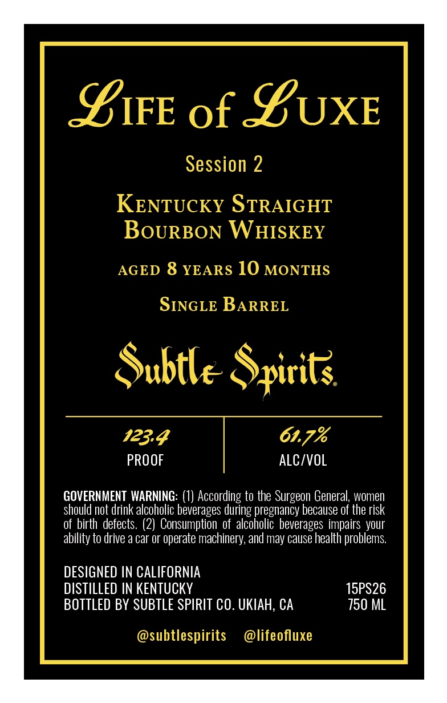
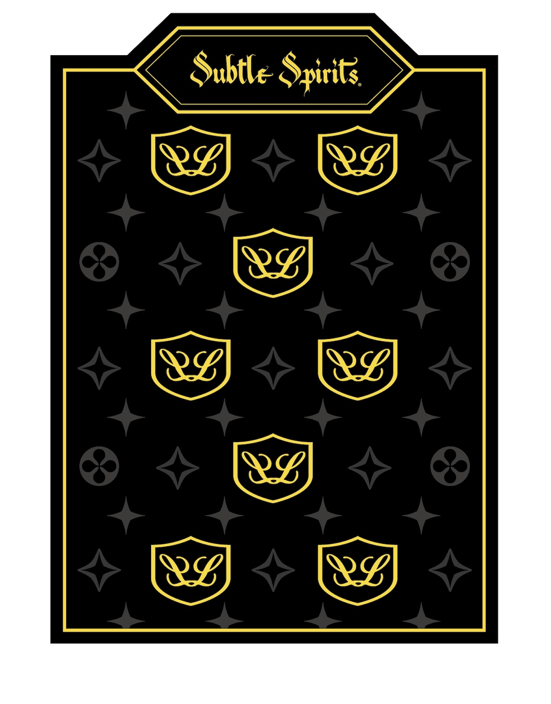

# TTB COLA Label Images - TTBID 26100001000515

**Brand Name:** SUBTLE SPIRITS

**Fanciful Name:** LIFE OF LUX 2

**Issue Date:** 04/13/2026

**Origin Code:** 01

**Product Class/Type:** 101

**Source:** [TTB Public COLA Registry](https://ttbonline.gov/colasonline/viewColaDetails.do?action=publicFormDisplay&ttbid=26100001000515)

## Label Images

### Back Label

### Front Label

## Extracted Label Text

*Text extracted via OCR - may contain errors*

*1 image(s) excluded: text did not meet readability threshold*

**Detected Proof:** 123.4
**Detected Age:** 8 Years

### Back Label

SIFE of SUXE
Session 2
KENTUCKY STRAIGHT
BoURBON WHISKEY
AGED 8 YEARS 10 MONTHS
SINGLE BARREL
Subtlc Spirit:
123.4
61.7%
PROOF
alC/VOL
GOVERNMENT WARNING: (1) According to the Surgeon General women
should not drink alcoholic beverages during pregnancy because of the risk
of birth defects. (2)  Consumption of  alcoholic beverages impairs your
ability to drive a car or operate machinery, and may cause health problems
DESIGNED IN CALIFORNIA
DISTILLED IN KENTUCKY
15PS26
BOTTLED BY SUBTLE SPIRIT CO. UKIAH; CA
750 ML
subtlespirits
@lifeofluxe
