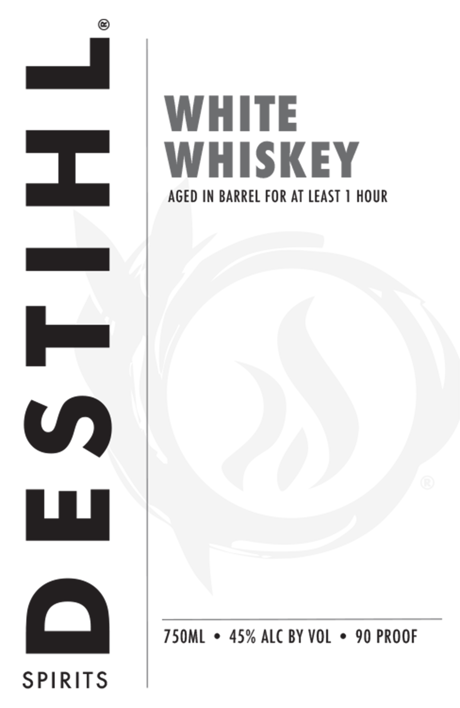
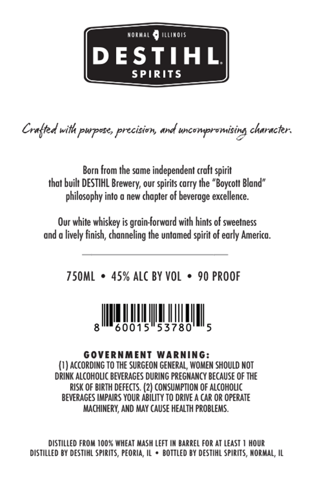

# TTB COLA Label Images - TTBID 26100001000611

**Brand Name:** DESTIHL SPIRITS WHITE WHISKEY

**Issue Date:** 04/14/2026

**Origin Code:** 04

**Product Class/Type:** 140

**Source:** [TTB Public COLA Registry](https://ttbonline.gov/colasonline/viewColaDetails.do?action=publicFormDisplay&ttbid=26100001000611)

## Label Images

### Label 1

### Label 2

## Extracted Label Text

*Text extracted via OCR - may contain errors*

**Detected Proof:** 90

### Label 1

WHITE

WHISKEY

AGED IN BARREL FOR AT LEAST 1 HOUR

dd

lex

VW)

LL

750ML © 45% ALCBY VOL * 90 PROOF

OQ

SPIRITS

### Label 2

NORMAL © iitinos

DESTIHL

SPIRITS

Crafted with purpose, precision, and uncompromising character.

Born from the same independent craft spirit

that built DESTIHL Brewery, our spirits carry the “Boycott Bland”

philosophy into a new chapter of beverage excellence.

Our white whiskey is grain-forward with hints of sweetness

and a lively finish, channeling the untamed spirit of early America

TSOML © 45% ALC BY VOL * 90 PROOF

nq,

GOVERNMENT WARNING:

(1) ACCORDING TO THE SURGEON GENERAL, WOMEN SHOULD NOT

DRINK ALCOHOLIC BEVERAGES DURING PREGNANCY BECAUSE OF THE

RISK OF BIRTH DEFECTS. (2) CONSUMPTION OF ALCOHOLIC

BEVERAGES IMPAIRS YOUR ABILITY TO DRIVE A CAR OR OPERATE

MACHINERY, AND MAY CAUSE HEALTH PROBLEMS.

DISTILLED FROM 100% WHEAT MASH LEFT IN BARREL FOR AT LEAST 1 HOUR

DISTILLED BY DESTIHL SPIRITS, PEORIA, IL * BOTTLED BY DESTIHL SPIRITS, NORMAL, IL
