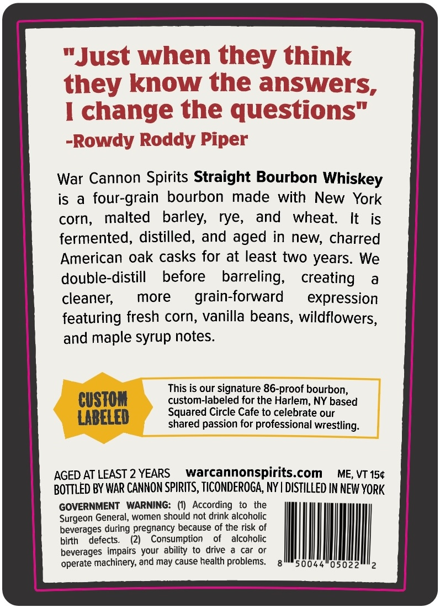
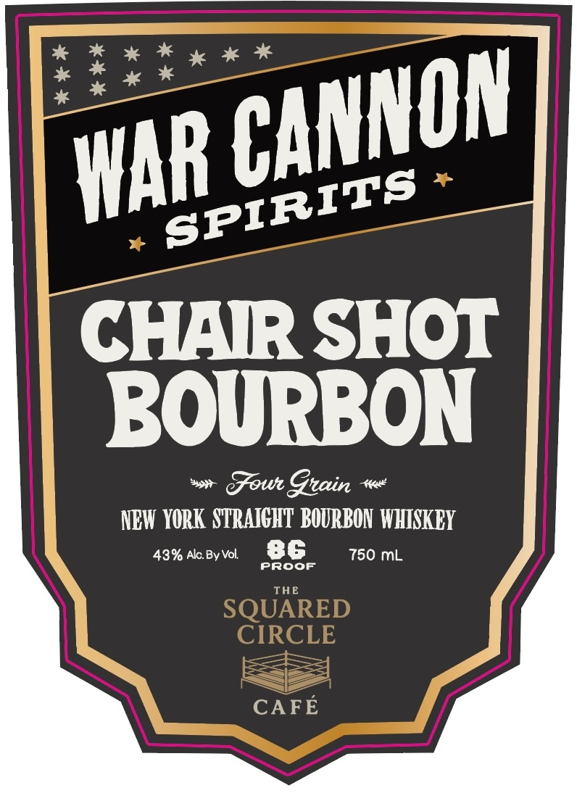

# TTB COLA Label Images - TTBID 26100001000707

**Brand Name:** WAR CANNON SPIRITS

**Fanciful Name:** CHAIR SHOT BOURBON

**Issue Date:** 04/14/2026

**Origin Code:** 02

**Product Class/Type:** 101

**Source:** [TTB Public COLA Registry](https://ttbonline.gov/colasonline/viewColaDetails.do?action=publicFormDisplay&ttbid=26100001000707)

## Label Images

### Back Label

### Front Label

## Extracted Label Text

*Text extracted via OCR - may contain errors*

**Detected Age:** 2 Years

### Back Label

wy he lems thausr ae
Just when they think
the Drnnuar tha nn
they know the answers
J eee
ehancda tha qiuacti WW
I change the questions"
-Rowdy Roddy Piper
War Cannon Spirits Straight Bourbon Whiskey
is a four-grain bourbon made with New York
corn, malted barley, rye, and wheat. It is
fermented, distilled, and aged in new, charred
American oak casks for at least two years. We
double-distill before barreling, creating a
cleaner, more  grain-forward expression
featuring fresh corn, vanilla beans, wildflowers,
and maple syrup notes.
This is our signature 86-proof bourbon,
CUSTOM custom-labeled for the Harlem, NY based
LABELED Squared Circle Cafe to celebrate our
shared passion for professional wrestling.
AGED ATLEAST 2 YEARS warcannonspirits.com ME, VT 15¢
BOTTLED BY WAR CANNON SPIRITS, TICONDEROGA, NY | DISTILLED IN NEW YORK
GOVERNMENT WARNING: (1) According to the
Surgeon General, women should not drink alcoholic
beverages during pregnancy because of the risk of WHIM
birth defects. (2) Consumption of alcoholic
beverages impairs your ability to drive a car or
‘operate machinery, and may cause health problems. g™*soo44"05022""2

### Front Label

CHAIR SHOT
BOURBON
Gowr Gnain
4
NBI YORK  SZRAICHT BOURBON THISKBY
439 AlcBy Vol
86
750 mL
Proof
THE
SQUARED
CIRCLE
CAFE
CANNON
WAR
SPIRITS
