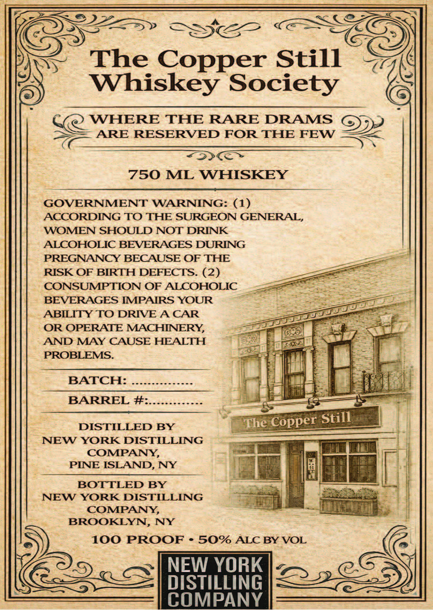
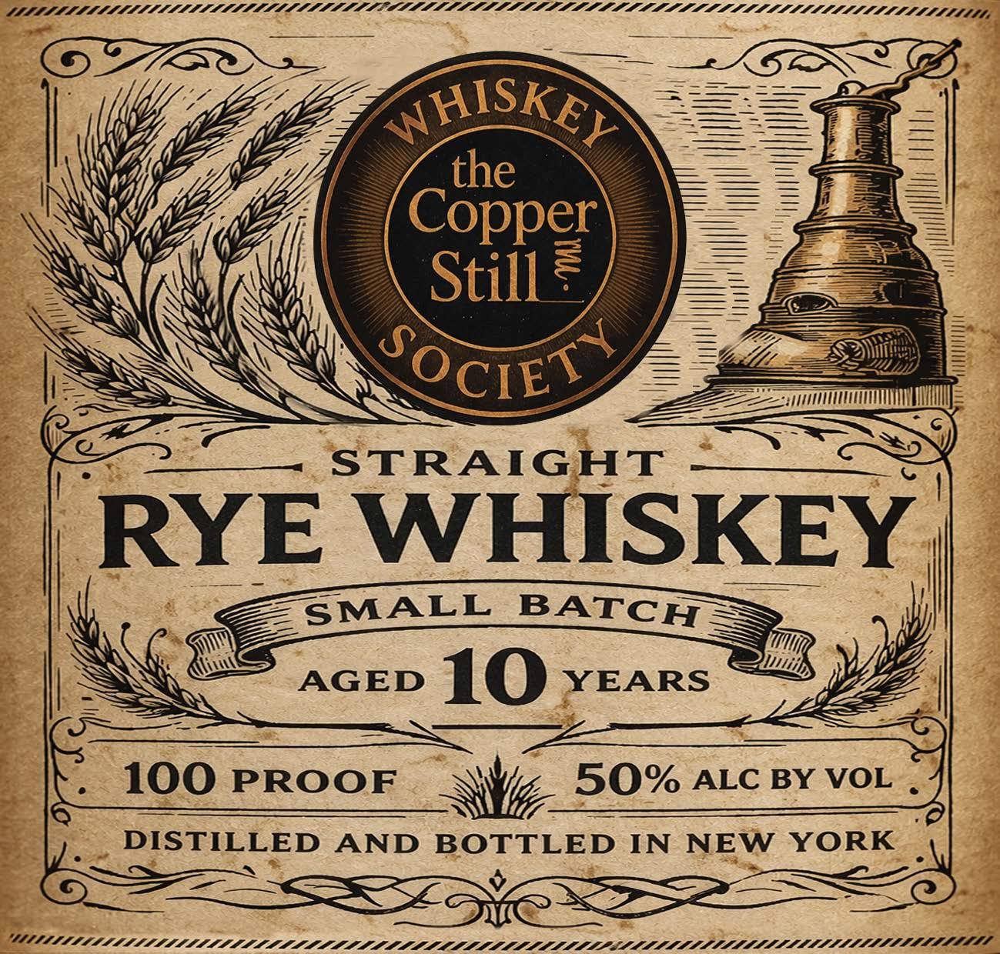

# TTB COLA Label Images - TTBID 26101001000023

**Brand Name:** THE COPPER STILL RYE WHISKEY

**Issue Date:** 04/14/2026

**Origin Code:** 02

**Product Class/Type:** 102

**Source:** [TTB Public COLA Registry](https://ttbonline.gov/colasonline/viewColaDetails.do?action=publicFormDisplay&ttbid=26101001000023)

## Label Images

### Back Label

### Front Label

## Extracted Label Text

*Text extracted via OCR - may contain errors*

**Detected Proof:** 100

### Back Label

78
The
Copper Still
Whiskey Society
WHERE THE RARE DRAMS
ARE RESERVED FOR THE FEW
750 ML WHISKEY
GOVERNMENT WARNING:
AcCORDING TO THE SURGEON GENERAL,
WOMEN SHOULD NOT DRINK
ALCOHOLIC BEVERAGES DURING
PREGNANCY BECAUSE OF THE
RISK OF BIRTH DEFECTS: (2)
CONSUMPTION OF ALCOHOLIC
BEVERAGES IMPAIRS YOUR
ABILITY TO DRIVE A CAR
OR OPERATE MACHINERY,
AND MAY CAUSE HEALTH
PROBLEMS:
BATCH:
BARREL #:
DISTILLED BY
The Copper
NEW YORK DISTILLING
COMPANY,
PINE ISLAND, NY
BOTTLED BY
NEW YORK DISTILLING
COMPANY
BROOKLYN,
NY
100 PROOF
50% ALC BY VOL
NEW YORK
DISTILLING
COMPANY
Still

### Front Label

LAALLLLALLLAALLLLLILADLI LAL OPPPPLALLIEIEDAAEOPPOPPOPOPPOPOOPPAPPPAPLLLLOLSSSAIIIISAL LSS,

STRAIGHT

RYE WHISKEY

100 PROOF i BON ALC BY VOL .

__ DISTILLED AND Sane IN NEW YORK :
% SE

~

WIITIPTALLALLL A LALA ALLA AAA A AAA AOS EE PETE
