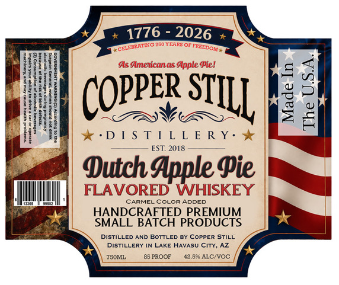
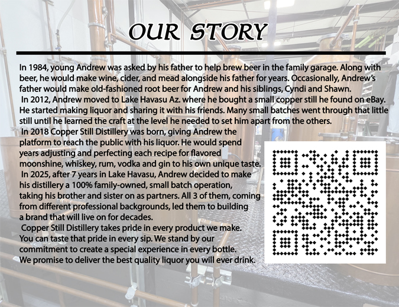

# TTB COLA Label Images - TTBID 26101001000056

**Brand Name:** COPPER STILL DISTILLERY

**Issue Date:** 04/13/2026

**Origin Code:** 11

**Product Class/Type:** 149

**Source:** [TTB Public COLA Registry](https://ttbonline.gov/colasonline/viewColaDetails.do?action=publicFormDisplay&ttbid=26101001000056)

## Label Images

### Label 1

### Label 2

## Extracted Label Text

*Text extracted via OCR - may contain errors*

**Detected Proof:** 85

### Label 1

1776 - 2026
250 YEARS OF
As Amejicanas Apple Piel
(OppeR:
J]
D [
S T [ L L E R Y _
EST; 2018
Dutch Apple $ie
FLAVORED WHISKEY
CARMEI
coloR ADDED
HANDCRAFTED PREMIUM
SMALL BATCH PRODUCTS
DISTILLED AND BOTTLED BY COPPER STILL
DISTiLLERY IN LAKE HAVASU City, AZ
TSOML
85 PROOF
42.590 ALC/vOC
CELLIRHTNG
FREEDOM -
STILL

### Label 2

OUR STORY
In 1984,young Andrew was asked by his father to help brew beer in the family garage. Along with
beer; he would make wine, cider; and mead alongside his father for years. Occasionally, Andrew's
father would make old-fashioned root beer for Andrew and his siblings, Cyndi and Shawn:
In 2012, Andrew moved to Lake Havasu Az. where he bought
small copper still he found on eBay:
He started making liquor and sharing it with his friends. Many small batches went through that little
still until he learned the craft at the level he needed to set him apart from the others_
In 2018 Copper Still Distillery was born, giving Andrew the
platform to reach the public with his liquor: He would spend
years adjusting and perfecting each recipe for flavored
moonshine, whiskey; rum_
vodka and gin to his own unique taste
In 2025,after
years in Lake Havasu, Andrew decided to make
his distillery
100% family-owned, small batch operation,
taking his brother and sister on as partners. All 3 of them, coming
from different professional backgrounds, led them to building
brand that will live on for decades:
Copper Still Distillery takes pride in every product we make:
You can taste that pride in every sip. We stand by our
commitment to create a special experience in every bottle_
We promise to deliver the best quality liquor you will ever drink:
