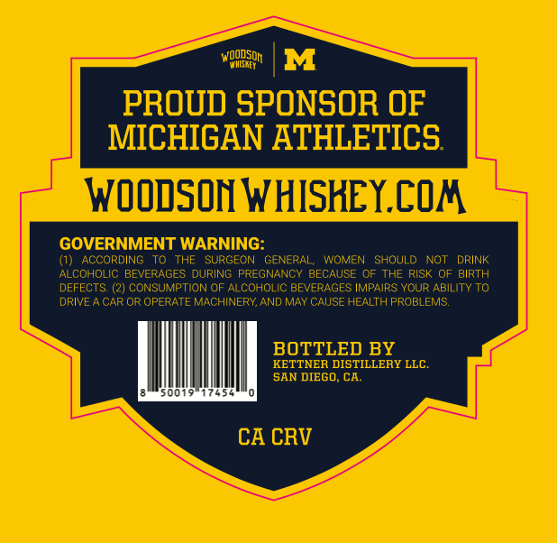
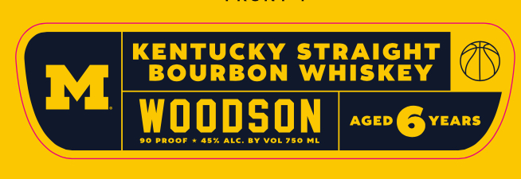
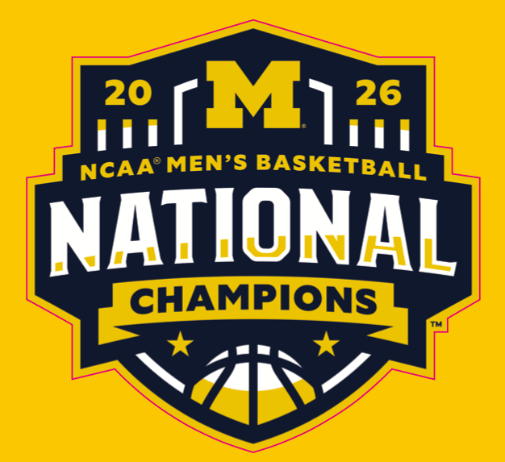
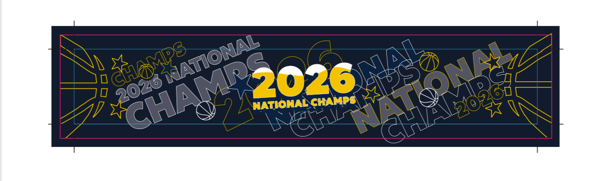

# TTB COLA Label Images - TTBID 26101001000059

**Brand Name:** WOODSON

**Fanciful Name:** NATIONAL CHAMPIONSHIP MI

**Issue Date:** 04/13/2026

**Origin Code:** 01

**Product Class/Type:** 101

**Source:** [TTB Public COLA Registry](https://ttbonline.gov/colasonline/viewColaDetails.do?action=publicFormDisplay&ttbid=26101001000059)

## Label Images

### Back Label

### Front Label

### Label 3

### Label 4

## Extracted Label Text

*Text extracted via OCR - may contain errors*

*2 image(s) excluded: text did not meet readability threshold*

**Detected Proof:** 90

### Back Label

WOODSOh
M
PROUD SPONSOR OF
MICHIGAN ATHLETICS
woODSON WHISKEY.COA
GOVERNMENT WARNING:
(1}  ACCORDING
THF
SURGEON
GENERAL,
WOMEN
SHOULD
NOT
DRINK
ALCOHOLIC BEVERAGES DURING
PREGNANCY BECAUSE OF THE
RISK OF BIRTH
DFFFCTS (2) CONSUMPTION OF ALCOHOLIC BEVERAGES IMPAIRS YOUR ABILITY TO
DRIVE
CAR OR OPERATE MACHINERY;
MAY CAUSE HEALTH PROBLEMS:
BOTTLED BY
KETTNER DISTILLERY LLC
SAN DIEGO, CA
CA CRV
AND

### Front Label

KENTUCKY STRAIGHT
BOURBON
WHISKEY
M
WOODSON
AGED
YEARS
90 PRoof
457 ALc. BY Vol 750
