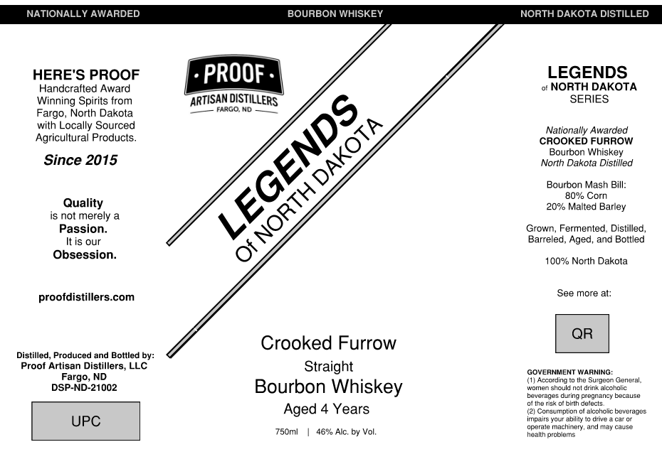

# TTB COLA Label Images - TTBID 26101001000104

**Brand Name:** LEGENDS OF NORTH DAKOTA

**Fanciful Name:** CROOKED FURROW BOURBON WHISKEY

**Issue Date:** 04/13/2026

**Origin Code:** 36

**Product Class/Type:** 101

**Source:** [TTB Public COLA Registry](https://ttbonline.gov/colasonline/viewColaDetails.do?action=publicFormDisplay&ttbid=26101001000104)

## Label Images

### Label 1

## Extracted Label Text

*Text extracted via OCR - may contain errors*

**Detected Proof:** 92
**Detected Age:** 4 Years

### Label 1

NATIONALLY AWARDED
BOURBON WHISKEY
NORTH DAKOTA DISTILLED
HERE'S PROOF
PROOF
LEGENDS
Handcrafted Award
NORTH DAKOTA
Winning Spirits from
IDISTILLERS
SERIES
Fargo, North Dakota
FARGO ND
with Locally Sourced
Nationally Awarded
Agricultura
Products_
CROOKED FURROW
Bourbon Whiskey
Since 2015
North Dakota Distillled
Bourbon Mash Bill:
80% Corn
Quality
20% Malted Barley
is not merely
Passion_
Grown, Fermented, Distilled _
It is our
Barreled, Aged
ano Bottled
Obsession:
0
100% North Dakota
proofdistillers com
See more at:
QR
Crooked Furrow
Distilled
Produced and Bottled by:
Proof Artisan Distillers; LLC
Straight
GOVERNMENT WARNING:
Fargo, ND
(1) According
the Surgeon General,
DSP-ND-21002
Bourbon Whiskey
women should nct dnnk alccholic
beverages during Fregnancy because
ol Ina ri5k
pirth derecls
Aged 4 Years
Conenmntinn
alcohclic beverages
UPC
irpairs your abiliy
opuraie
machirtery
and may cause
750ml
46% Alc; by Vol;,
Hgallm prubiums
ARTISANL
LEGENDS
DAKOTA
NORTH
