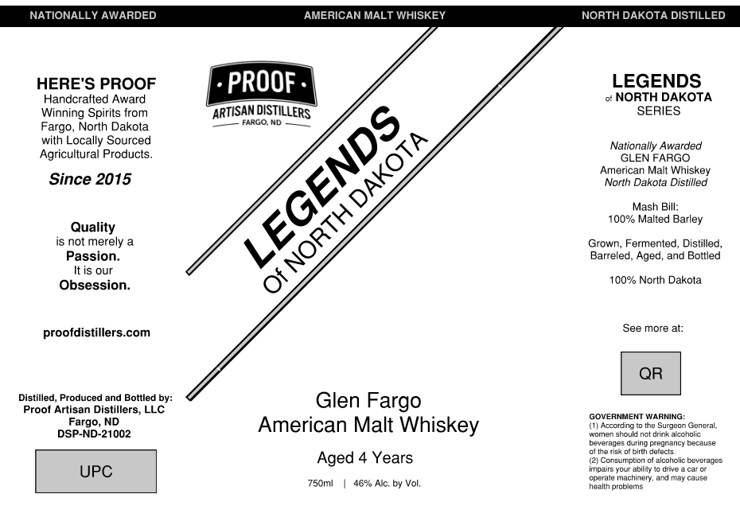

# TTB COLA Label Images - TTBID 26101001000110

**Brand Name:** LEGENDS OF NORTH DAKOTA

**Fanciful Name:** GLEN FARGO AMERICAN MALT WHISKEY

**Issue Date:** 04/13/2026

**Origin Code:** 36

**Product Class/Type:** 118

**Source:** [TTB Public COLA Registry](https://ttbonline.gov/colasonline/viewColaDetails.do?action=publicFormDisplay&ttbid=26101001000110)

## Label Images

### Label 1

## Extracted Label Text

*Text extracted via OCR - may contain errors*

**Detected Proof:** 92
**Detected Age:** 4 Years

### Label 1

NATIONALLY AWARDED
AMERICAN MALT WHISKEY
NORTH DAKOTA DISTILLED
HERE'S PROOF
PROOF
LEGENDS
Handcrafted Award
NORTH DAKOTA
Winning Spirits from
IDISTILLERS
SERIES
Fargo, North Dakota
FARGO ND
with Locally Sourced
Nationally Awarded
Agricultura
Products_
GLEN FARGO
American Malt Whiskey
Since 2015
North Dakota Distilled
Mash Bill:
100 Malted Barley
Quality
is not merely
Grown, Fermented, Distilled_
Passion_
Barreled, Aged_
and Bottled
It is our
Obsession:
0
100% Norlh Dakola
proofdistillers com
See more at:
QR
Distilled
Produced and Bottled by:
Glen
Fargo
Proof Artisan Distillers; LLC
GOVERNMENT WARNING:
Fargo, ND
American Malt Whiskey
(1) According
the Surgeon General,
DSP-ND-21002
women should nct dnnk alccholic
beverages during Fregnancy because
ol Ina ri5k
pirth derecls
Aged 4 Years
(21 Ccngumption
alcohclic beverages
UPC
irpairs your abiliy
opuraie
machirtery
and may cause
750ml
46% Alc; by Vol;,
Hgallm prubiums
ARTISANL
LEGENDS
DAKOTA
NORTH
