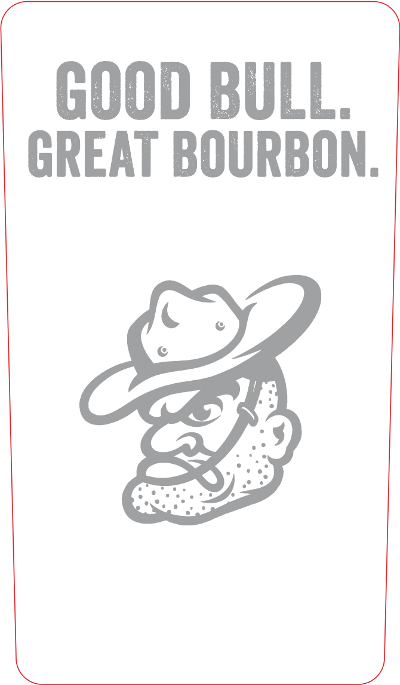
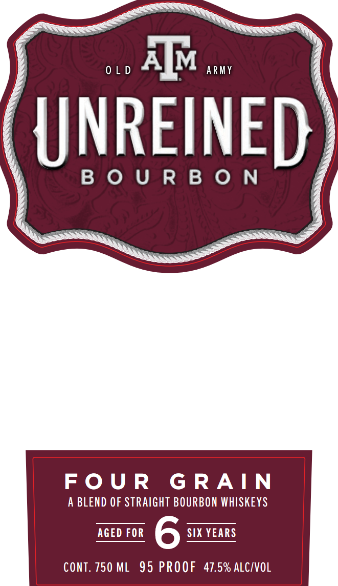
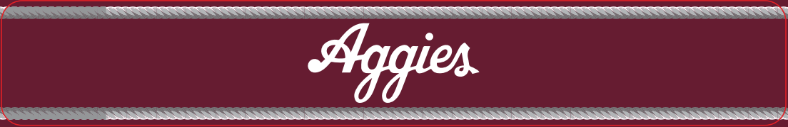

# TTB COLA Label Images - TTBID 26101001000116

**Brand Name:** UNREINED

**Fanciful Name:** FOUR GRAIN

**Issue Date:** 04/13/2026

**Origin Code:** 44

**Product Class/Type:** 121

**Source:** [TTB Public COLA Registry](https://ttbonline.gov/colasonline/viewColaDetails.do?action=publicFormDisplay&ttbid=26101001000116)

## Label Images

### Back Label

### Front Label

### Label 3

## Extracted Label Text

*Text extracted via OCR - may contain errors*

*2 image(s) excluded: text did not meet readability threshold*

**Detected Proof:** 95

### Front Label

£ See SS yy
AIM |
y OLD = ARMY 4
y BOURBON 4

FOUR GRAIN

A BLEND OF STRAIGHT BOURBON WHISKEYS

AGED FOR 6 SIX YEARS
CONT. 750 ML 95 PROOF 47.5% ALC/VOL
