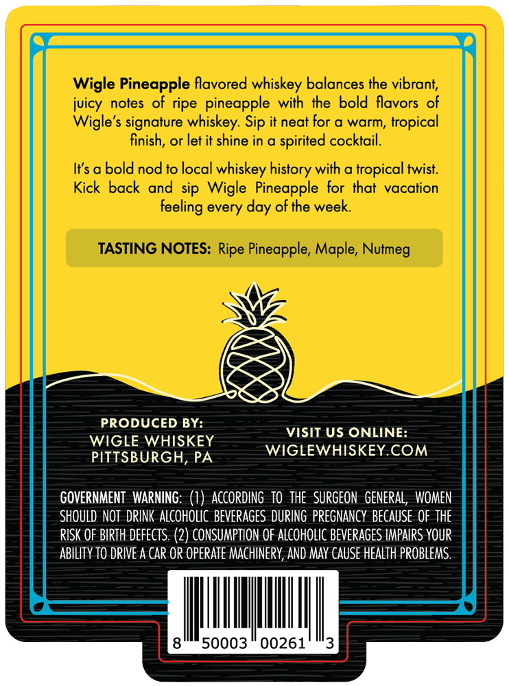
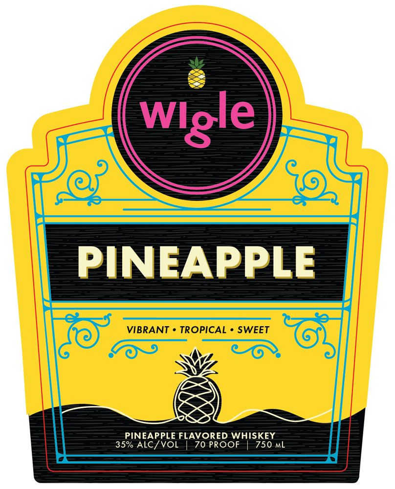

# TTB COLA Label Images - TTBID 26103001000029

**Brand Name:** WIGLE

**Fanciful Name:** PINEAPPLE

**Issue Date:** 04/29/2026

**Origin Code:** 39

**Product Class/Type:** 149

**Source:** [TTB Public COLA Registry](https://ttbonline.gov/colasonline/viewColaDetails.do?action=publicFormDisplay&ttbid=26103001000029)

## Label Images

### Back Label

### Front Label

## Extracted Label Text

*Text extracted via OCR - may contain errors*

**Detected Proof:** 70

### Back Label

Wigle Pineapple flavored whiskey balances the vibrant;
juicy
notes of ripe   pineapple with the bold flavors of
Wigle's signature whiskey: Sip it neat for @ warm, tropical
finish, or let it shine in a
spirited cocktail.
Its a bold nod to local whiskey history with a tropical twist
Kick back and sip Wigle Pineapple for that vacation
every
ofthe week:
TASTING NOTES: Ripe Pineapple; Maple,
PRODUCED BY:
VISIT US ONLINE:
WIGLE WHISKEY
WIGLEWHISKEY COM
PITTSBURGH, PA
GOVERNMENT  WARNING: (7)   ACCORdINg   tO   THE  SURGEON   general,  WOMEN
SHOULD  NOT  DRINK ALcohOLIC  BeveRAGeS  DURING  PReGnancy BECAUSe OF THE
RISK OF BIRTH defects: (2) CONSUMPTION OF ALCoHOLIc BEvERAGES IMPAIRS YOUR
ABILITY TO DRIVE A Car OR OPERate MAchinery; AND MAY CAUSE HEALTh PROBLEMS
50003
00261
feeling
day
Nutmeg

### Front Label

PINEAPPLE
VIBRANT
TROPICAL
SWEET
PINEAPPLE FLAVORED WHISKEY
35% ALC/VOL
70 PROOF
750 mL
Wlgle
