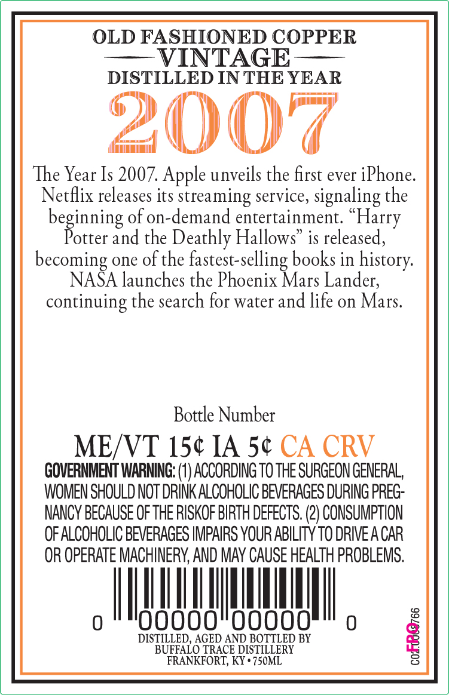

# TTB COLA Label Images - TTBID 26103001000092

**Brand Name:** OFC

**Issue Date:** 04/14/2026

**Origin Code:** 22

**Product Class/Type:** 101

**Source:** [TTB Public COLA Registry](https://ttbonline.gov/colasonline/viewColaDetails.do?action=publicFormDisplay&ttbid=26103001000092)

## Label Images

### Back Label

### Front Label

## Extracted Label Text

*Text extracted via OCR - may contain errors*

### Back Label

OLD FASHIONED COPPER
VINTAGE
DISTILLED IN THE YEAR
20c
The Year Is 2007. Apple unveils the first ever iPhone:
Netflix releases its streaming service, signaling the
beginning of on-demand entertainment;
Potter and the Deathly Hallows'
is released,
becoming one of the fastest-selling books in history:
NASA launches the Phoenix Mars Lander;
continuing the search for water and life on Mars.
Bottle Number
MEAVT 15c IA 5c CA CRV
GOVERNMENT WARNING: (4) ACCORDING TO THE SURGEON GENERAL,
WOMEN SHOULD NOT DRINK ALCOHOLIC BEVERAGES DURING PREG
NANCY BECAUSE OF THE RISKOF BIRTH DEFECTS: (2) CONSUMPTION
OF ALCOHOLIC BEVERAGES IMPAIRS YOUR ABILITY TO DRIVE A CAR
OR OPERATE MACHINERY; AND MAy CAUSE HEALTH PROBLEMS.
Oooo0
0
DISTILLED, AGED AND BOTTLED BY
1
BUFFALO TRACE DISTILLERY
FRANKFORT; KY ' 750ML
Harry

### Front Label

KEnTUCKY STRAIGHT BOURBOM WHISKEY
657 alcIvOL /90 PROOFL
