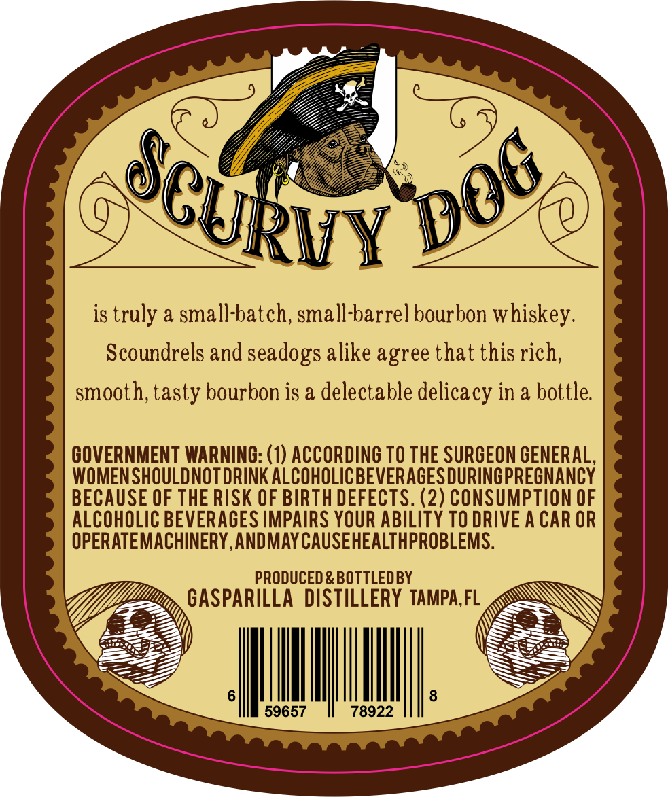
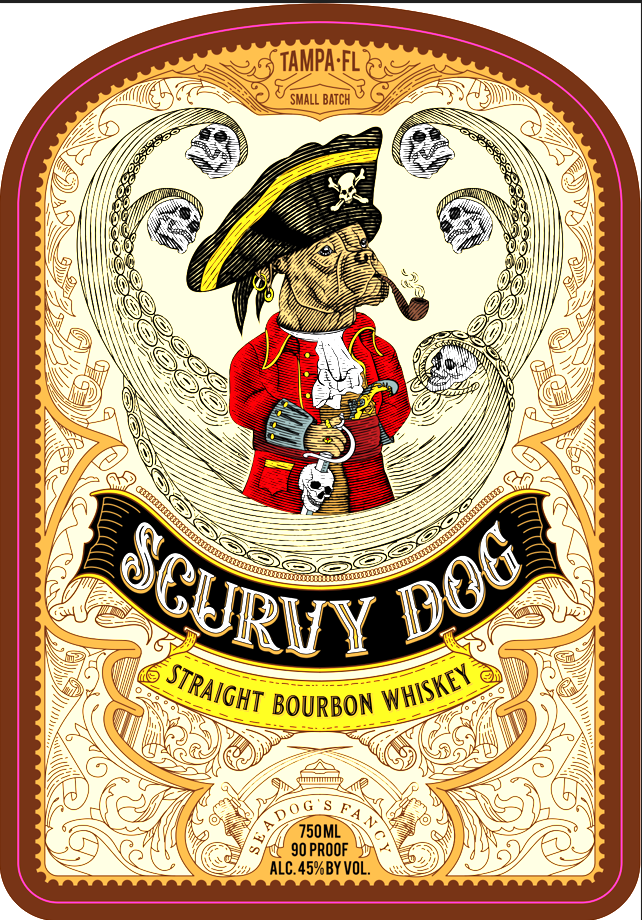

# TTB COLA Label Images - TTBID 26103001000104

**Brand Name:** SCURVY DOG

**Issue Date:** 04/14/2026

**Origin Code:** 16

**Product Class/Type:** 101

**Source:** [TTB Public COLA Registry](https://ttbonline.gov/colasonline/viewColaDetails.do?action=publicFormDisplay&ttbid=26103001000104)

## Label Images

### Back Label

### Front Label

## Extracted Label Text

*Text extracted via OCR - may contain errors*

**Detected Proof:** 90

### Back Label

is truly a small-batch; small-barrel bourbon whiskey.
Scoundrels and seadogs alike agree that this rich;
smooth; tasty bourbon is a delectable delicacy in & bottle
GOVERNMENT WARNING: (1) ACCORDING TO THE SURGEON GENERAL,
WOMENSHOULDNOT DRINK ALCOHOLICBEVERAGESDURINGPREONANCY
BECAUSE OF THE RISK OF BIRTH DEFECTS. (2) CONSUMPTION OF
ALCOHOLIC BEVERAGES IMPAIRS YOUR ABILITY TO DRIVE A CAR OR
OPERATEMACHINERY,ANDMAY CAUSEHEALTHPROBLEMS.
PRODUCED & BOTTLEDBY
GASPARILLA  DISTILLERY TAMPA,FL
59657
78922
JeURuY

### Front Label

TAMPA FL
SMALL BATCh
BOURBON
750ML
90 PROOF
ALC. 45%BY VOL.
DOC
CURIY
STRAIGHT
WHISKEY
