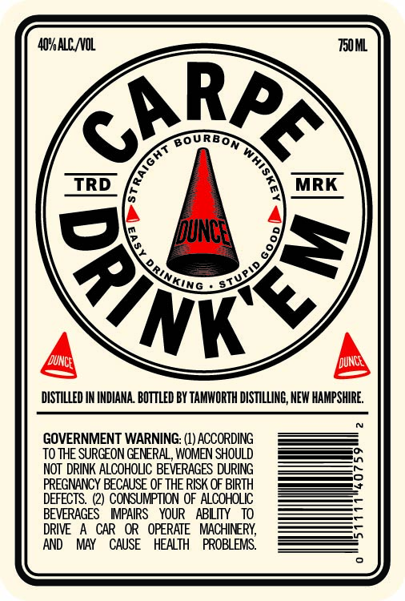
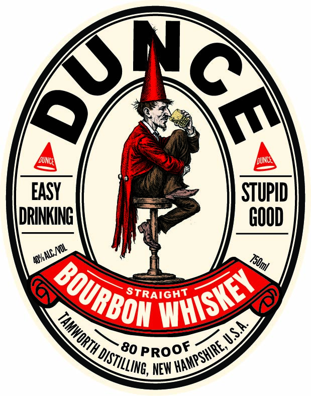

# TTB COLA Label Images - TTBID 26103001000136

**Brand Name:** DUNCE

**Issue Date:** 04/15/2026

**Origin Code:** 33

**Product Class/Type:** 101

**Source:** [TTB Public COLA Registry](https://ttbonline.gov/colasonline/viewColaDetails.do?action=publicFormDisplay&ttbid=26103001000136)

## Label Images

### Back Label

### Front Label

### Label 3

## Extracted Label Text

*Text extracted via OCR - may contain errors*

*1 image(s) excluded: text did not meet readability threshold*

### Back Label

AQHA NOL

TS0ML

RA

OURBO

Ke

a

TRD

MRK

Wing

SY

K

DISTILLED IN INDIANA. BOTTLED BY TAMWORTH DISTILLING, NEW HAMPSHIRE,

GOVERNMENT WARNING: (1) ACCORDING

TO THE SURGEON GENERAL, WOMEN SHOULD

NOT DRINK ALCOHOLIC BEVERAGES DURING

EGNANCY BECAUSE OF THE RISK OF BIRTH

DEFECTS. (2) CONSUMPTION OF ALCOHOLIC

BEVERAGES IMPAIRS YOUR ABLITY 10

DRIVE A CAR OR OPERATE MACHINERY,

AND MAY CAUSE HEALTH PROBLEMS.

### Front Label

FDUNce
Iduncet
EASY
STUPID
[DRINKING T
GOOD
STRAiGHT
80
NEW =
m
'BOURBOH
WHISKEY
TAMWORTH L
HAMPSHIRE, W S:
PROOF
DISTILLING;, "
