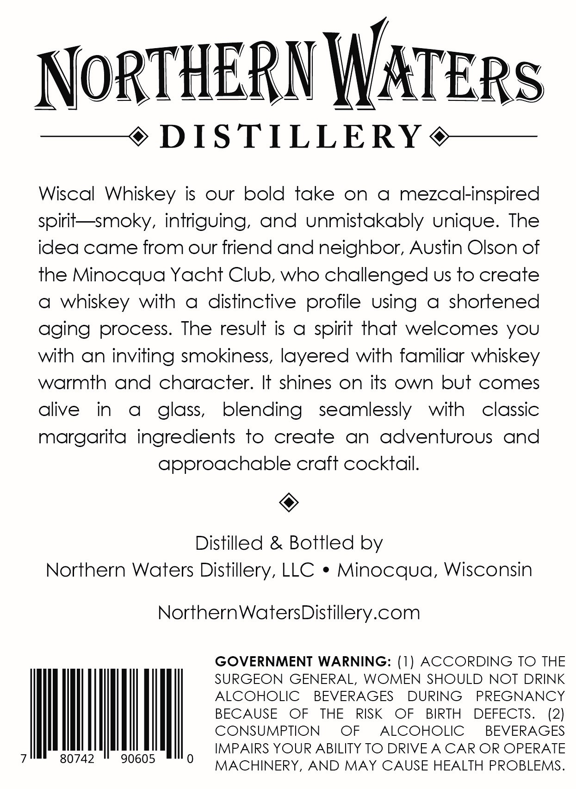
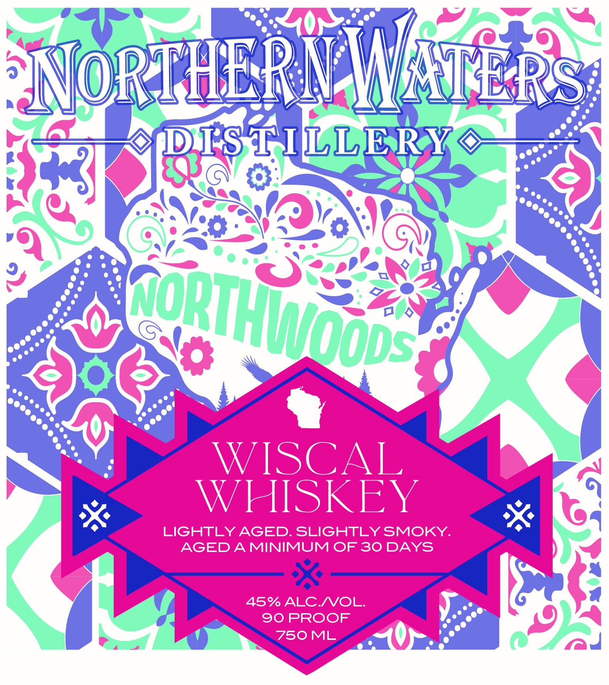

# TTB COLA Label Images - TTBID 26103001000202

**Brand Name:** WISCAL WHISKEY

**Issue Date:** 04/17/2026

**Origin Code:** 48

**Product Class/Type:** 140

**Source:** [TTB Public COLA Registry](https://ttbonline.gov/colasonline/viewColaDetails.do?action=publicFormDisplay&ttbid=26103001000202)

## Label Images

### Back Label

### Front Label

## Extracted Label Text

*Text extracted via OCR - may contain errors*

**Detected Proof:** 90

### Back Label

NorTHERN WATERs

—¢ DISTILLERY @¢——

Wiscal Whiskey is our bold take on a mezcalinspired

spirit—smoky, intriguing, and unmistakably unique. The

idea came from our friend and neighbor, Austin Olson of

the Minocqua Yacht Club, who challenged us to create

a whiskey with a distinctive profile Using a shortened

aging process. The result is a spirit that welcomes you

with an inviting smokiness, layered with familiar whiskey

warmth and character. It shines on its own but comes

alive

in a_ glass

blending seamlessly with classic

margarita ingredients to create an adventurous and

approachable craft cocktail

©

Distilled & Bottled by

Northern Waters Distillery, LLC * Minocqua, Wisconsin

NorthernWatersDistillery.com

OVERNMENT WARNING: (1) ACCORDING TO THE

SURGEON GENERAL, WOMEN SHOULD NOT DRINK

ALCOHOLIC BEVERAGES DURING PREGNANCY

BECAUSE OF THE RISK OF BIRTH DEFECTS

CONSUMPTION = OF

ALCOHOLIC

BEVERAGES

(2)

Iii

IMPAIRS YOUR ABILITY TO DRIVE A CAR OR OPERATE

|

80742

90605

MACHINERY, AND MAY CAUSE HEALTH PROBLEMS

### Front Label

NoRTHERIWITERs
TS TILLER
WISCAL
WHISKEY
LIGHTLY AGED.SLIGHTLY SMOKY.
AGEDAMINIMUM OF 30 DAYS
45% ALC NOL
90 PROOF
750ML
2
coethhodps:
