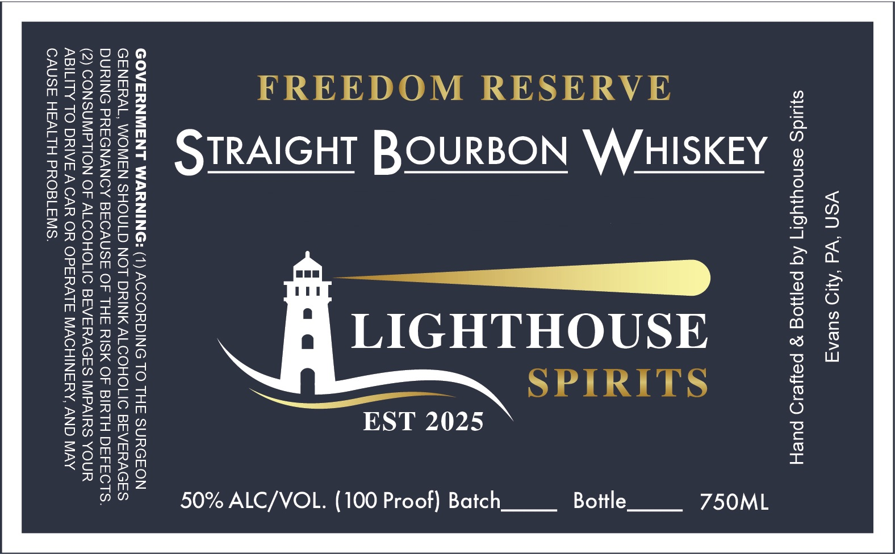

# TTB COLA Label Images - TTBID 26103001000238

**Brand Name:** LIGHTHOUSE SPIRITS

**Fanciful Name:** FREEDOM RESERVE

**Issue Date:** 04/14/2026

**Origin Code:** 39

**Product Class/Type:** 101

**Source:** [TTB Public COLA Registry](https://ttbonline.gov/colasonline/viewColaDetails.do?action=publicFormDisplay&ttbid=26103001000238)

## Label Images

### Label 1

## Extracted Label Text

*Text extracted via OCR - may contain errors*

**Detected Proof:** 100

### Label 1

YSN ‘Wd ‘AO sueng
S}ids asnoujybr] Aq peyyjog 9g peyeio puey

750ML

Bottle

SPIRITS

EST 2025

LIGHTHOUSE

>
LL
Ww
”
=a
-_<
4
& O
a6
© O
Qa cd
oe oe
yo
x ©
mH <
[a4
—
Y)

50% ALC/VOL. (100 Proof) Batch

GOVERNMENT WARNING: (1) ACCORDING TO THE SURGEON
GENERAL, WOMEN SHOULD NOT DRINK ALCOHOLIC BEVERAGES
DURING PREGNANCY BECAUSE OF THE RISK OF BIRTH DEFECTS.
(2) CONSUMPTION OF ALCOHOLIC BEVERAGES IMPAIRS YOUR
ABILITY TO DRIVE A CAR OR OPERATE MACHINERY, AND MAY
CAUSE HEALTH PROBLEMS.
