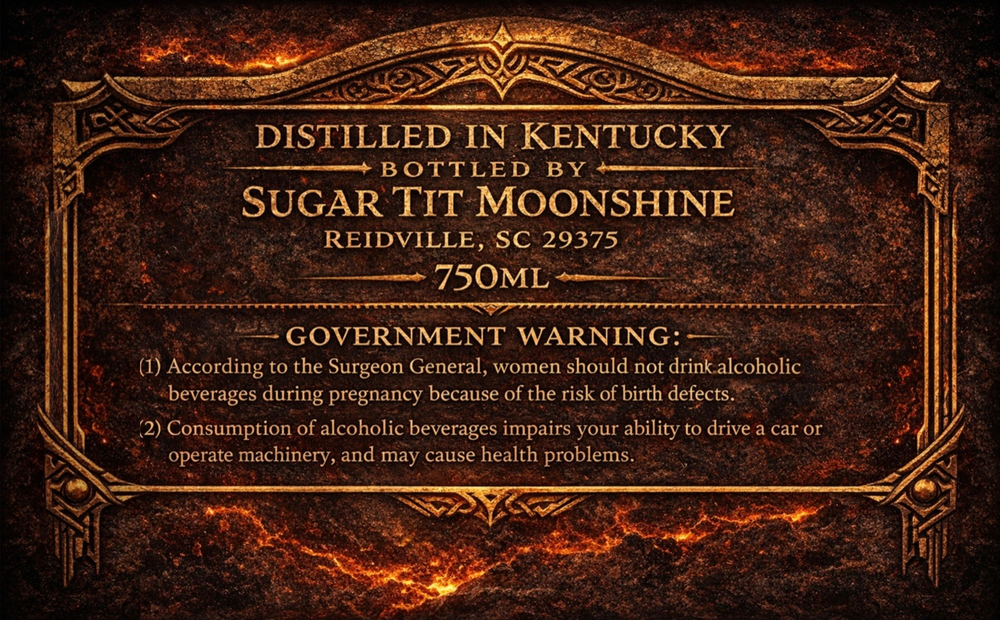
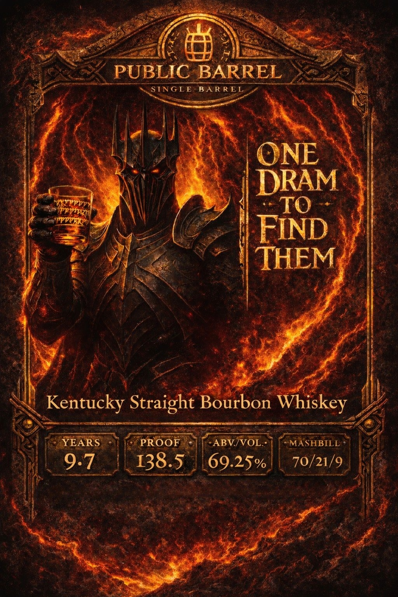

# TTB COLA Label Images - TTBID 26103001000269

**Brand Name:** PUBLIC BARREL

**Issue Date:** 04/15/2026

**Origin Code:** 41

**Product Class/Type:** 101

**Source:** [TTB Public COLA Registry](https://ttbonline.gov/colasonline/viewColaDetails.do?action=publicFormDisplay&ttbid=26103001000269)

## Label Images

### Back Label

### Front Label

## Extracted Label Text

*Text extracted via OCR - may contain errors*

**Detected Proof:** 138.5

### Back Label

DISTILLED IN KENTUCKY
B OTTLED
BY
SUGAR TIT MOONSHINE
REIDVILLE , SC 29375
750ML
GOVERNMENT WARNING:
(1) According to the Surgeon General, women should not drink alcoholic
beverages during pregnancy because of the risk of birth defects.
2) Consumption of alcoholic beverages impairs
ability to drive a car or
operate machinery, and may cause health problems.
your

### Front Label

PUBLIC
BARREL
STNGLE
BA R REL
ONE
DRAM
TO
FIND
THEM
Kentucky Straight Bourbon Whiskey
YEARS
PROOF
ABV/VOL
MASHBILL
9.7
138.5
69.25%
70/21/9
