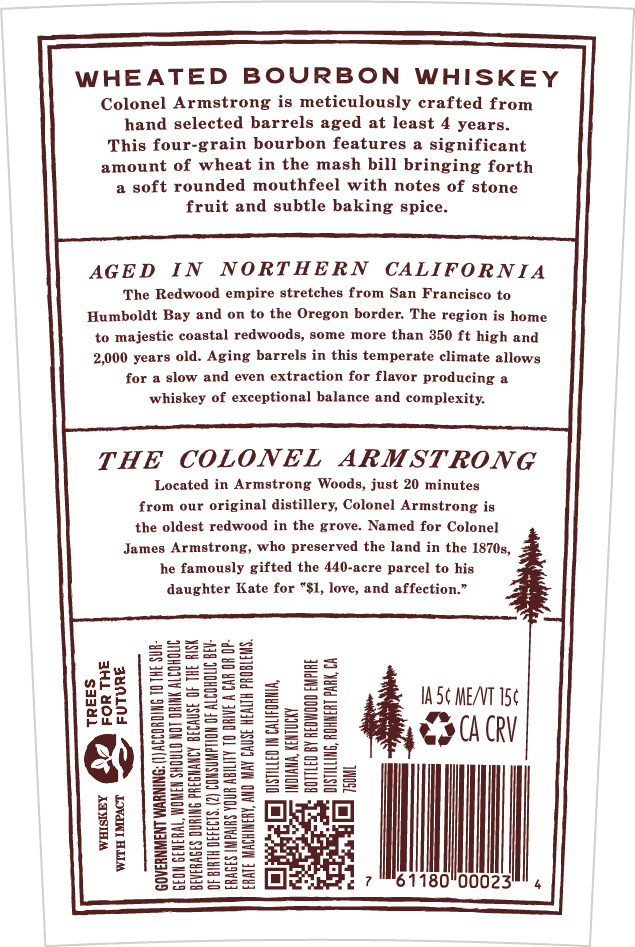
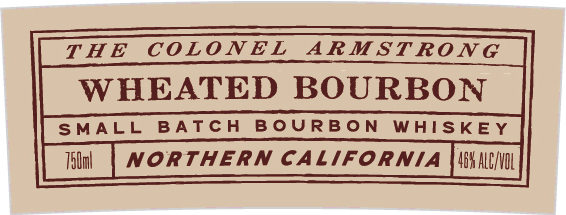
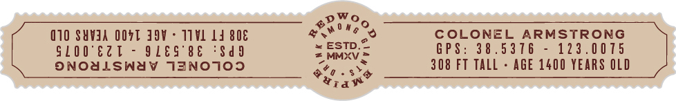

# TTB COLA Label Images - TTBID 26103001000291

**Brand Name:** REDWOOD EMPIRE

**Fanciful Name:** COLONEL ARMSTRONG

**Issue Date:** 04/14/2026

**Origin Code:** 01

**Product Class/Type:** 141

**Source:** [TTB Public COLA Registry](https://ttbonline.gov/colasonline/viewColaDetails.do?action=publicFormDisplay&ttbid=26103001000291)

## Label Images

### Back Label

### Front Label

### Label 4

## Extracted Label Text

*Text extracted via OCR - may contain errors*

**Detected Age:** 4 Years

### Back Label

WHEATED BOURBON WHISKEY
Colonel Armstrong is meticulously crafted from
hand selected barrels aged at least 4 years.

This four-grain bourbon features a significant
amount of wheat in the mash bill bringing forth
a soft rounded mouthfeel with notes of stone
fruit and subtle baking spice.

AGED IN NORTHERN CALIFORNIA
‘The Redwood empire stretches from San Francisco to
Humboldt Bay and on to the Oregon border. The region is home
to majestic coastal redwoods, some more than 350 ft high and
2,000 years old. Aging barrels in this temperate climate allows
for a slow and even extraction for flavor producing a
whiskey of exceptional balance and complexity.

THE COLONEL ARMSTRONG

Located in Armstrong Woods, just 20 minutes
from our original distillery, Colonel Armstrong is
the oldest redwood in the grove. Named for Colonel

James Armstrong, who preserved the land in the 1870s,

he famously gifted the 440-acre parcel to his
daughter Kate for “$1, love, and affection.”

INK ALCOROUC

PREGNANCY BECAUSE OF THE RISK

IASC MEAT 5¢
COUR

‘00023 4

JACCORDING 10 THE SUR
TION OF ALCORDLIC BEV-
TO DRIVE A CAR OR OP-

OISTILLED IN CALIFORNIA,
A INDIANA, KENTUCKY
aa £0 BY REDWOOD EMPIRE

Col

18.
|ATE MACHINERY, AND MAY CAUSE HEALTH PROBLEMS.

EON GENERAL, WOMEN SHOULD NOT DRI

BEVERAGES DUF
OF BIRTH DEE

‘GOVERNMENT WARNIE

ERAGES IMPAIRS YOUR Al

### Front Label

T H E
COLONEL
ARMST RON G
WHEATED BOURBON
SMALL BATCH
B oURB 0 N
WhISKEY
TElul
northeRn CALIFORNIA
4BX ALENVIL

### Label 4

Cay)
(10 SUVIA OOFT IOV - T1VL Ld 808 getters COLONEL ARMSTRONG
GLOO'EZT - QLES°8E ‘Sad Srey = GPS: 38.5376 - 123.0075
ONOALSWAY TANO109 oto . os 308 FT TALL - AGE 1400 YEARS OLD
was
