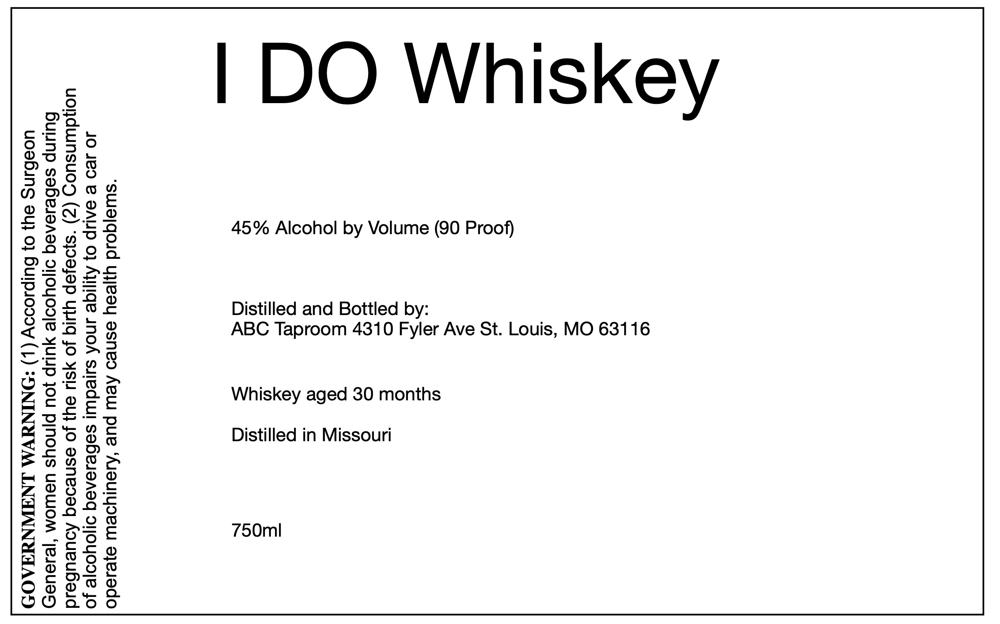

# TTB COLA Label Images - TTBID 26103001000341

**Brand Name:** ABC TAPROOM LLC.

**Issue Date:** 04/21/2026

**Origin Code:** 29

**Product Class/Type:** 140

**Source:** [TTB Public COLA Registry](https://ttbonline.gov/colasonline/viewColaDetails.do?action=publicFormDisplay&ttbid=26103001000341)

## Label Images

### Label 1

## Extracted Label Text

*Text extracted via OCR - may contain errors*

**Detected Proof:** 90

### Label 1

45% Alcohol by Volume (90 Proof)
ABC Taproom 4310 Fyler Ave St. Louis, MO 63116
Whiskey aged 30 months

Distilled and Bottled by:
Distilled in Missouri

>
®
<
L
i
=
O
QC)

“Suua|qoid uyjeoy asneo Aew pure ‘Aiauiyoew o}esedo

JO Je9 © SAUIP 0} Ayiqe 4NoA suredw sebesenegq o1jOYyooje Jo
uondwnsuoy (Z) ‘s}oajep YI jo ySUU 9y} Jo asneoeq Aoueubeid
Bulinp seBeseregq o1Oyooje YULIP JOU Pjnoys UsWOM ‘|eseUey
uoeBbung ay} 0} Bulpsoooy (|) -*ONINAVM LNAWNYAAOD
