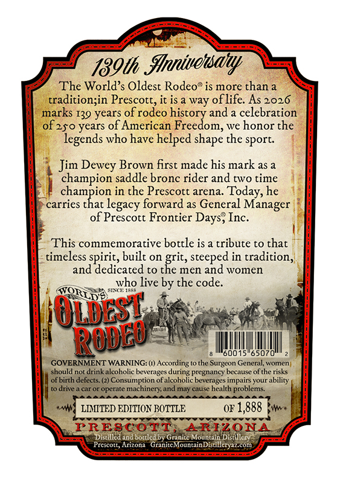
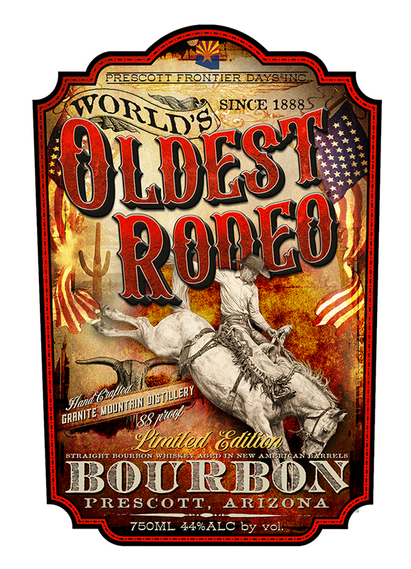

# TTB COLA Label Images - TTBID 26103001000353

**Brand Name:** GRANITE MOUNTAIN DISTILLERY

**Fanciful Name:** WORLD'S OLDEST RODEO BOURBON

**Issue Date:** 04/14/2026

**Origin Code:** 11

**Product Class/Type:** 101

**Source:** [TTB Public COLA Registry](https://ttbonline.gov/colasonline/viewColaDetails.do?action=publicFormDisplay&ttbid=26103001000353)

## Label Images

### Back Label

### Front Label

## Extracted Label Text

*Text extracted via OCR - may contain errors*

**Detected Proof:** 88

### Back Label

189th  inivottsany
The World's Oldest Rodeo" is more than a
tradition;in Prescott, it is a way oflife: As 2026
marks 139 years of rodeo history and a celebration
years of American Freedom, we honor the
legends who have helped
the sport:
Jim Dewey Brown first made his mark as a
champion saddle bronc rider and cwo time
in the Prescott arena. Today, he
carries
rchesmbiole
forward as General Manager
of Prescott Frontier Days; Inc:
This commemorative bottle is a tribute to that
timeless spirit, built on grit, steeped in tradition,
and dedicated
the men and women
who live by the code_
STI
RLIS
O1DE5!
60015"65070
GOVERNMENT WARNING: (1) According to the Surgeon General;, women
should not drink alcoholic beverages
pregnancy because ofthe risks
ofbirth defects: (2) Consumption of
Fadotokc bexeancy berpaise ofuhrabiskty
t0 drive .
caror operate machinery; and may cause health problems
LLMITED EDITION BOTTLE
OF
1,888
PRESCOTT
ARIZONA
Distilled and boteled Dy
OnamineMotntau
Distillery
Prescott,
GriniteMountainDistilleryazcom
of 250
shape
legacy
ROdeu
Arizona

### Front Label

PRESCOTT ERONZIER DAZHN
SINCE 18885
Uw55
Htfand l
88
%irited Gdition
STIAICHT
ROUTKOR
JN NKT
YIRRKLA
BOURBOA
PRESCOTT
ARIZONA
75OML 44%ALC by vol:
Roneu
Wistillery
'Muunihn
GRANITE _
' ptoct
