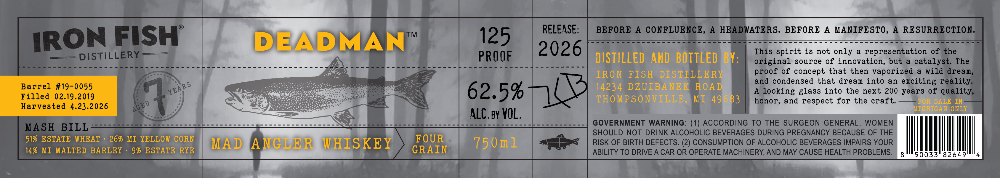

# TTB COLA Label Images - TTBID 26103001000370

**Brand Name:** DEADMAN

**Issue Date:** 04/15/2026

**Origin Code:** 06

**Product Class/Type:** 140

**Source:** [TTB Public COLA Registry](https://ttbonline.gov/colasonline/viewColaDetails.do?action=publicFormDisplay&ttbid=26103001000370)

## Label Images

### Label 1

## Extracted Label Text

*Text extracted via OCR - may contain errors*

**Detected Proof:** 125

### Label 1

RELEASE:
BEFORE
A=
CONFLUENCE,
A
HEADWATERS. BEFORE
A MANIFESTO,
A RESURRECTION_
IRON FISH
DEADMAN
TM
125
2026
This spirit is not only
representation 0f the
DISTILLERY
PROOF
DISTILLED  AND BOTTLED BY:
original source 0f innovation, but
catalyst: The
IRON FISH DISTILLERY
proof 0f concept that then vaporized
a wild dream,
and condensed that dream into
an
exciting reality.
Barrel #19-0055
62.5%
14234 DZUIBANEK ROAD
A
looking glass into the next 200 years of quality_
Filled 02.19.2019
THO MPSONVILLE;
MI 49683
honor, and respect for the craft.
FOR SALE IN
Harvested 4.23.2026
MIGHIGAN ONLY
ALC. By VOL.
GOVERNMENT WARNING: (1) ACCORDING TO THE SURGEON GENERAL, WOMEN
MASH
BILL
SHOULD NOT DRINK ALCOHOLIC BEVERAGES DURING PREGNANCY BECAUSE OF THE
519 ESTATE WHEAT
269 MI YELLOW CORN
MAD
ANGLE R
WHISKEY
FOUR
750m1
RISK OF BIRTH DEFECTS. (2) CONSUMPTION OF ALCOHOLIC BEVERAGES IMPAIRS YOUR
14% MI MALTED BARLEY
9% ESTATE RYE
GRAIN
ABILITY TO DRIVE A CAR OR OPERATE MACHINERY AND MAY CAUSE HEALTH PROBLEMS.
8
50033"826
YEARS
AGED
